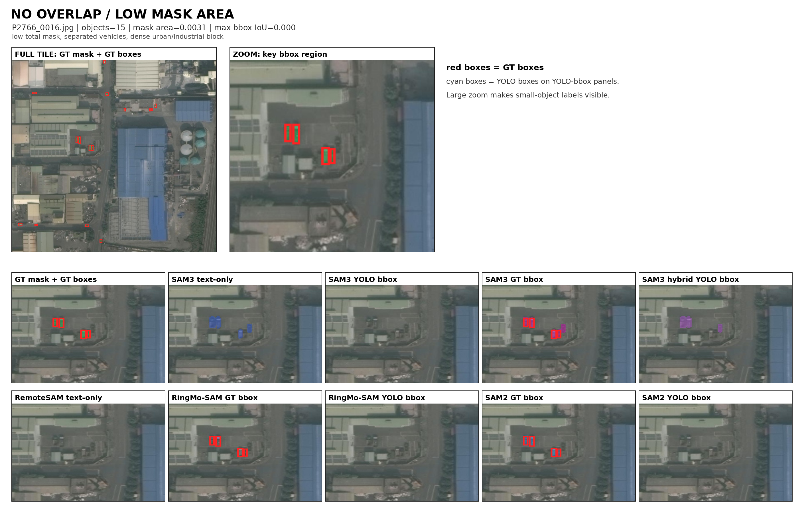
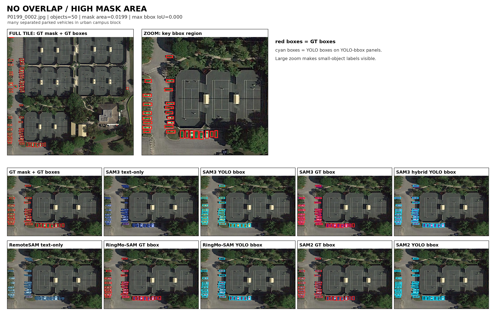
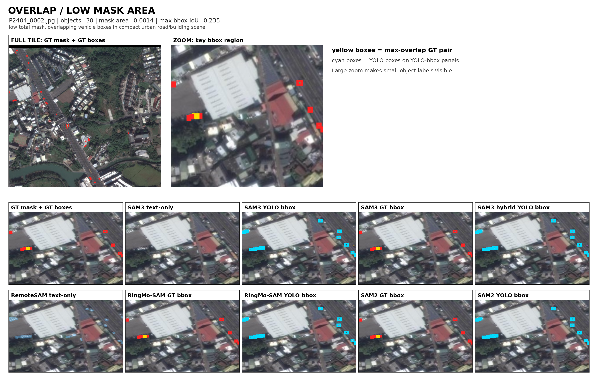
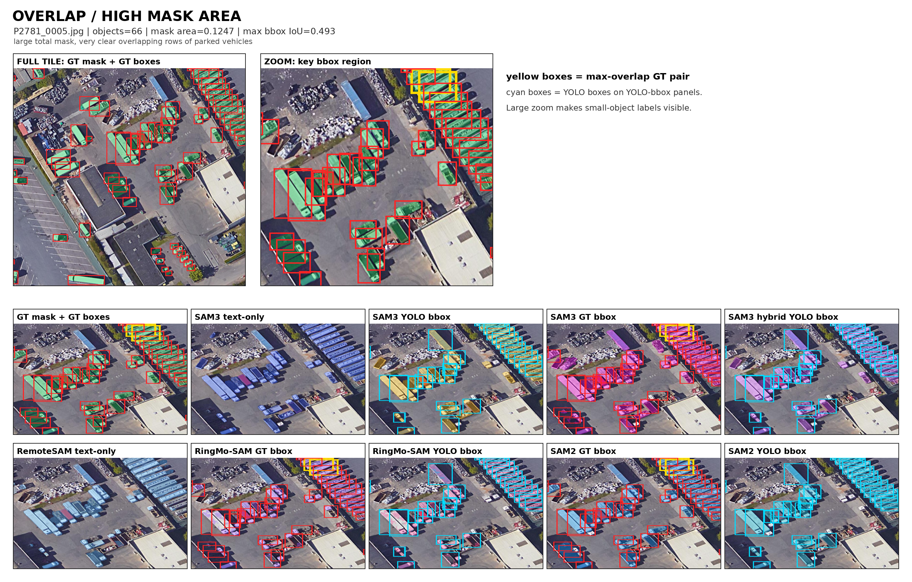

# iSAID Vehicle Segmentation Metric Report

## Scope

- Veri seti: iSAID değerlendirme bölümü; `Small_Vehicle` ve `Large_Vehicle` çokgenlerinden birleştirilmiş `vehicle` sınıfı kullanıldı.
- Değerlendirme kümesi: 128 pozitif 1024 x 1024 görüntü parçası. Kümeler dört gruba dengelendi: örtüşme yok/var ve düşük/yüksek hedef maske alanı.
- Bu rapordan çıkarılan hatlar: GroundingDINO + SAM2, SegEarth-OV3 + SAM3 ve SAM3 hybrid GT bbox.
- SAM3 hybrid GT bbox çıkarıldı çünkü GT bbox zaten nesnenin gerçek konumunu veriyor. Kusursuz bbox promptunun üstüne metin eklemek ana benchmark için temiz bir ölçüm değil ve yorumu karıştırıyor.
- Raporda kalan hatlar: SAM3 text only, SAM3 YOLO bbox, SAM3 GT bbox, SAM3 hybrid YOLO bbox, RemoteSAM text only, RingMo-SAM GT bbox, RingMo-SAM YOLO bbox, SAM2 GT bbox ve SAM2 YOLO bbox.

## Metric Logic

- Tüm segmentasyon metrikleri her görüntü için birleştirilmiş ikili araç maskesi üzerinde hesaplandı: tahmin edilen araç ön planı, GT araç ön planıyla karşılaştırıldı.
- TP (doğru pozitif): modelin `vehicle` dediği ve GT maskesinde de gerçekten `vehicle` olan piksel sayısı.
- FP (yanlış pozitif): modelin `vehicle` dediği ama GT'de arka plan olan piksel sayısı. FP yüksekse maske araç dışına taşıyor demektir.
- FN (yanlış negatif): GT'de `vehicle` olan ama modelin kaçırdığı piksel sayısı. FN yüksekse model araç piksellerini eksik yakalıyor demektir.
- TN (doğru negatif) arka plan-arka plan pikselleridir. IoU, Dice, kesinlik ve duyarlılık formüllerinde kullanılmaz; çünkü arka plan çok büyük olduğu için skoru yapay olarak şişirebilir.
- `IoU`, piksel kesişiminin piksel birleşimine oranıdır: `TP / (TP + FP + FN)`.
- `Dice`, `2TP / (2TP + FP + FN)` olarak hesaplanır. IoU gibi bir örtüşme skorudur ve aynı maske için genellikle IoU'dan daha yüksek görünür.
- Kesinlik, `TP / (TP + FP)` olarak hesaplanır. Düşük kesinlik, tahmin maskesinin araç dışı alanları da fazla kapsadığını gösterir.
- Duyarlılık, `TP / (TP + FN)` olarak hesaplanır. Düşük duyarlılık, modelin GT araç piksellerini kaçırdığını gösterir.
- `Ortalama` metrikler görüntü seviyesinde ortalamadır: metrik önce her görüntü için ayrı hesaplanır, sonra görüntü skorları ortalanır. Tek bir büyük görüntü son ortalamada ekstra ağırlık almaz.
- Buna rağmen tek bir görüntünün içinde hesap hâlâ piksel tabanlıdır. Büyük nesneler veya büyük maske bölgeleri o görüntünün TP/FP/FN sayımlarını domine edebilir. Bu etkiyi görmek için düşük/yüksek maske alanı grupları ayrıca raporlanmıştır.
- `Pred/GT Area`, tahmin edilen ön plan piksel sayısının GT ön plan piksel sayısına oranıdır. 1'in üzerindeki değerler aşırı segmentasyona, 1'in altındaki değerler eksik segmentasyona işaret eder.
- Segmentasyon `mAP50 proxy`, `mAP75 proxy` ve `mAP90 proxy` değerleri görüntü seviyesinde IoU eşik geçme oranlarıdır: `mAP50 proxy` IoU >= 0.50 olan görüntü oranı, `mAP75 proxy` IoU >= 0.75 olan görüntü oranı, `mAP90 proxy` ise IoU >= 0.90 olan görüntü oranıdır.
- Segmentasyon `mAP50-95 proxy`, 0.50, 0.55, ..., 0.95 eşiklerindeki görüntü geçme oranlarının ortalamasıdır. Bu değer hâlâ birleştirilmiş maske proxy metriğidir; COCO nesne örneği AP değeri değildir.
- YOLO detector metrikleri bbox metriğidir, maske metriği değildir. Detector tarafındaki IoU, tahmin edilen YOLO bbox ile GT bbox arasındaki kutu örtüşmesini ifade eder.
- YOLO detector `BBox mAP50`, `BBox mAP75`, `BBox mAP90` ve `BBox mAP50-95` değerleri ayrıca gerçek COCO bounding-box AP metriği olarak hesaplandı.

## Dataset and Paper Context

- [iSAID orijinal makalesi](https://arxiv.org/abs/1905.12886): 2.806 yüksek çözünürlüklü hava görüntüsü, 15 kategori ve 655.451 nesne örneği içerir. Makale, hava görüntülerinde nesne örneği segmentasyonunu zor yapan nedenleri açıkça vurgular: görüntü başına çok sayıda nesne, büyük ölçek farkları ve çok sayıda küçük nesne.
- Bu çalışma iSAID'i yalnızca birleştirilmiş araç hedefi üzerinden kullanır: `Small_Vehicle` + `Large_Vehicle`. Bu yüzden tablolardaki skorlar resmi 15 sınıflı iSAID nesne örneği AP skoru değildir; araç maskesine odaklanan daha dar bir stres testidir.
- [RemoteSAM](https://arxiv.org/abs/2505.18022), RemoteSAM-270K adlı 270K görüntü-metin-maske referanslı segmentasyon veri setini oluşturur ve iSAID, LoveDA, DOTA, HRRSD gibi ana uzaktan algılama kaynaklarını entegre eder. Bu nedenle burada kutusuz metin tabanlı bir temel karşılaştırma hattı olarak güçlü çıkması beklenebilir.
- [RemoteSAM proje sayfası](https://github.com/1e12Leon/RemoteSAM), RemoteSAM-270K veri setini ve yer gözlemi referanslı metin istemleri için geniş semantik/özellik kapsamını ayrıca açıklar.
- [RingMo-SAM](https://doi.org/10.1109/TGRS.2023.3332219), optik ve SAR görüntüler için geliştirilmiş çok modlu uzaktan algılama SAM tarzı bir modeldir. Makalede, birden çok açık uzaktan algılama veri setinden toplanmış milyonlarca segmentasyon nesne örneği ile büyük ölçekli bir eğitim kümesi kurulduğu; iSAID, ISPRS Vaihingen, ISPRS Potsdam ve AIR-PolSAR-Seg gibi veri setlerinde değerlendirildiği belirtilir.
- RemoteSAM'i yalnızca metin durumunda geçmek değil, YOLO + SAM2'nin RemoteSAM yalnızca metin hattını geçmesi bu çalışmadaki asıl pratik başarı noktasıdır. Bizim YOLO dedektörümüz iSAID araç alanına özel lokalizasyon sağlıyor; SAM2 de iyi kutu verildiğinde maskeyi güçlü biçimde tamamlıyor.
- RingMo-SAM bu çalışmada yüksek kesinlik ama düşük duyarlılık gösteriyor. Bu, uzaktan algılama için ince ayar yapılmış olmanın tek başına yeterli olmadığını; özellikle küçük ve yoğun araçlarda modelin temiz ama eksik maske üretmeye meyilli olduğunu gösteriyor.

## YOLO Detector BBox Metrics

Not: Bu tablo YOLO'yu yalnızca detector olarak değerlendirir. Buradaki IoU, tahmin edilen bbox ile GT bbox arasındaki BBox IoU'dur. Maske IoU değildir; maske kalitesi segmentasyon tablolarında değerlendirilir.

| Split | Images | Detections | AP conf | Fixed conf | BBox mAP50 | BBox mAP75 | BBox mAP90 | BBox mAP50-95 | BBox Precision@0.50 | BBox Recall@0.50 | BBox Precision@0.75 | BBox Recall@0.75 | BBox Precision@0.90 | BBox Recall@0.90 |
| --- | --- | --- | --- | --- | --- | --- | --- | --- | --- | --- | --- | --- | --- | --- |
| değerlendirme | 128 | 16403 | 0.0010 | 0.2000 | 0.6792 | 0.4270 | 0.0497 | 0.4002 | 0.5826 | 0.7302 | 0.4176 | 0.5234 | 0.0886 | 0.1111 |

## Segmentation Tables

DOCX/PDF çıktılarında 0.0-1.0 aralığındaki başarı metrikleri kırmızıdan sarıya, sarıdan yeşile giden renk ölçeğiyle boyanır.

### Overall

Not: Bu tablodaki segmentasyon mAP proxy değerleri, her model hattı için 128 görüntü üzerinden hesaplanan görüntü seviyesinde IoU eşik geçme oranlarıdır. `mAP50 proxy`, `mAP75 proxy` ve `mAP90 proxy`; IoU >= 0.50, 0.75 ve 0.90 olan görüntü oranlarıdır. `mAP50-95 proxy`, 0.50 ile 0.95 arasındaki eşikleri ortalar.

| Pipeline | Images | Avg IoU | Avg Dice | Avg Precision | Avg Recall | Pred/GT Area | mAP50 proxy | mAP75 proxy | mAP90 proxy | mAP50-95 proxy |
| --- | --- | --- | --- | --- | --- | --- | --- | --- | --- | --- |
| SAM3 text only | 128 | 0.2739 | 0.3782 | 0.3589 | 0.5850 | 21.4385 | 0.2109 | 0.0469 | 0.0000 | 0.0773 |
| SAM3 YOLO bbox | 128 | 0.4076 | 0.5328 | 0.5130 | 0.6485 | 4.2319 | 0.3750 | 0.0781 | 0.0000 | 0.1375 |
| SAM3 GT bbox | 128 | 0.5230 | 0.6510 | 0.5826 | 0.8072 | 3.9708 | 0.6641 | 0.1484 | 0.0078 | 0.2414 |
| SAM3 hybrid YOLO bbox | 128 | 0.3413 | 0.4554 | 0.4127 | 0.6655 | 12.2751 | 0.3125 | 0.0625 | 0.0000 | 0.1102 |
| RemoteSAM text only | 128 | 0.3850 | 0.5132 | 0.5244 | 0.5993 | 2.8578 | 0.3359 | 0.0234 | 0.0000 | 0.1125 |
| RingMo-SAM GT bbox | 128 | 0.2625 | 0.3592 | 0.7247 | 0.2815 | 0.3257 | 0.1875 | 0.0469 | 0.0000 | 0.0703 |
| RingMo-SAM YOLO bbox | 128 | 0.2349 | 0.3266 | 0.6292 | 0.2630 | 0.4435 | 0.1641 | 0.0391 | 0.0000 | 0.0547 |
| SAM2 GT bbox | 128 | 0.6581 | 0.7842 | 0.6929 | 0.9278 | 1.4278 | 0.8750 | 0.2656 | 0.0000 | 0.3922 |
| SAM2 YOLO bbox | 128 | 0.4336 | 0.5615 | 0.5494 | 0.6549 | 1.8826 | 0.4141 | 0.1016 | 0.0000 | 0.1523 |

### No Overlap / Low Mask Area

Not: Bu tablodaki segmentasyon mAP proxy değerleri, her model hattı için 32 görüntü üzerinden hesaplanan görüntü seviyesinde IoU eşik geçme oranlarıdır. `mAP50 proxy`, `mAP75 proxy` ve `mAP90 proxy`; IoU >= 0.50, 0.75 ve 0.90 olan görüntü oranlarıdır. `mAP50-95 proxy`, 0.50 ile 0.95 arasındaki eşikleri ortalar.

| Pipeline | Images | Avg IoU | Avg Dice | Avg Precision | Avg Recall | Pred/GT Area | mAP50 proxy | mAP75 proxy | mAP90 proxy | mAP50-95 proxy |
| --- | --- | --- | --- | --- | --- | --- | --- | --- | --- | --- |
| SAM3 text only | 32 | 0.1789 | 0.2495 | 0.2387 | 0.5797 | 77.3608 | 0.1250 | 0.0625 | 0.0000 | 0.0531 |
| SAM3 YOLO bbox | 32 | 0.3078 | 0.4128 | 0.3787 | 0.6256 | 11.5545 | 0.2500 | 0.0312 | 0.0000 | 0.0969 |
| SAM3 GT bbox | 32 | 0.4980 | 0.6172 | 0.5327 | 0.8549 | 11.4195 | 0.6250 | 0.1562 | 0.0312 | 0.2406 |
| SAM3 hybrid YOLO bbox | 32 | 0.1889 | 0.2723 | 0.2345 | 0.6375 | 42.7998 | 0.1250 | 0.0000 | 0.0000 | 0.0375 |
| RemoteSAM text only | 32 | 0.3563 | 0.4687 | 0.4509 | 0.6190 | 6.3635 | 0.3125 | 0.0625 | 0.0000 | 0.1156 |
| RingMo-SAM GT bbox | 32 | 0.1391 | 0.1894 | 0.5056 | 0.1449 | 0.1567 | 0.1562 | 0.0312 | 0.0000 | 0.0469 |
| RingMo-SAM YOLO bbox | 32 | 0.1184 | 0.1681 | 0.4296 | 0.1372 | 0.4220 | 0.1250 | 0.0000 | 0.0000 | 0.0187 |
| SAM2 GT bbox | 32 | 0.6490 | 0.7762 | 0.6917 | 0.9259 | 1.4898 | 0.9062 | 0.2188 | 0.0000 | 0.3812 |
| SAM2 YOLO bbox | 32 | 0.3647 | 0.4771 | 0.4456 | 0.6320 | 3.1647 | 0.3438 | 0.0938 | 0.0000 | 0.1281 |

### No Overlap / High Mask Area

Not: Bu tablodaki segmentasyon mAP proxy değerleri, her model hattı için 32 görüntü üzerinden hesaplanan görüntü seviyesinde IoU eşik geçme oranlarıdır. `mAP50 proxy`, `mAP75 proxy` ve `mAP90 proxy`; IoU >= 0.50, 0.75 ve 0.90 olan görüntü oranlarıdır. `mAP50-95 proxy`, 0.50 ile 0.95 arasındaki eşikleri ortalar.

| Pipeline | Images | Avg IoU | Avg Dice | Avg Precision | Avg Recall | Pred/GT Area | mAP50 proxy | mAP75 proxy | mAP90 proxy | mAP50-95 proxy |
| --- | --- | --- | --- | --- | --- | --- | --- | --- | --- | --- |
| SAM3 text only | 32 | 0.3244 | 0.4530 | 0.4125 | 0.7460 | 3.3583 | 0.2500 | 0.0312 | 0.0000 | 0.0781 |
| SAM3 YOLO bbox | 32 | 0.5269 | 0.6669 | 0.6304 | 0.7722 | 2.7089 | 0.5938 | 0.1562 | 0.0000 | 0.2094 |
| SAM3 GT bbox | 32 | 0.6380 | 0.7677 | 0.6705 | 0.9310 | 1.5965 | 0.9062 | 0.2500 | 0.0000 | 0.3438 |
| SAM3 hybrid YOLO bbox | 32 | 0.4351 | 0.5652 | 0.4945 | 0.8072 | 2.8372 | 0.5000 | 0.0938 | 0.0000 | 0.1719 |
| RemoteSAM text only | 32 | 0.4563 | 0.5989 | 0.6415 | 0.6223 | 0.9513 | 0.4375 | 0.0000 | 0.0000 | 0.1344 |
| RingMo-SAM GT bbox | 32 | 0.3656 | 0.4963 | 0.8842 | 0.3870 | 0.4279 | 0.2500 | 0.0625 | 0.0000 | 0.0906 |
| RingMo-SAM YOLO bbox | 32 | 0.3315 | 0.4570 | 0.8027 | 0.3597 | 0.4199 | 0.2500 | 0.0625 | 0.0000 | 0.0844 |
| SAM2 GT bbox | 32 | 0.7421 | 0.8510 | 0.7772 | 0.9430 | 1.2189 | 1.0000 | 0.4688 | 0.0000 | 0.5312 |
| SAM2 YOLO bbox | 32 | 0.5339 | 0.6779 | 0.6960 | 0.7139 | 1.0475 | 0.5625 | 0.1250 | 0.0000 | 0.2031 |

### Overlap / Low Mask Area

Not: Bu tablodaki segmentasyon mAP proxy değerleri, her model hattı için 32 görüntü üzerinden hesaplanan görüntü seviyesinde IoU eşik geçme oranlarıdır. `mAP50 proxy`, `mAP75 proxy` ve `mAP90 proxy`; IoU >= 0.50, 0.75 ve 0.90 olan görüntü oranlarıdır. `mAP50-95 proxy`, 0.50 ile 0.95 arasındaki eşikleri ortalar.

| Pipeline | Images | Avg IoU | Avg Dice | Avg Precision | Avg Recall | Pred/GT Area | mAP50 proxy | mAP75 proxy | mAP90 proxy | mAP50-95 proxy |
| --- | --- | --- | --- | --- | --- | --- | --- | --- | --- | --- |
| SAM3 text only | 32 | 0.1748 | 0.2614 | 0.2529 | 0.3687 | 3.4945 | 0.0625 | 0.0000 | 0.0000 | 0.0125 |
| SAM3 YOLO bbox | 32 | 0.2663 | 0.3798 | 0.3864 | 0.4781 | 1.5710 | 0.1250 | 0.0000 | 0.0000 | 0.0344 |
| SAM3 GT bbox | 32 | 0.3668 | 0.4956 | 0.4551 | 0.6302 | 1.6554 | 0.3750 | 0.0000 | 0.0000 | 0.1031 |
| SAM3 hybrid YOLO bbox | 32 | 0.2323 | 0.3354 | 0.3086 | 0.4871 | 2.1873 | 0.0938 | 0.0000 | 0.0000 | 0.0250 |
| RemoteSAM text only | 32 | 0.2365 | 0.3513 | 0.3800 | 0.4615 | 3.0095 | 0.0938 | 0.0000 | 0.0000 | 0.0187 |
| RingMo-SAM GT bbox | 32 | 0.1478 | 0.2291 | 0.6288 | 0.1651 | 0.2288 | 0.0000 | 0.0000 | 0.0000 | 0.0000 |
| RingMo-SAM YOLO bbox | 32 | 0.1139 | 0.1812 | 0.4409 | 0.1377 | 0.4287 | 0.0000 | 0.0000 | 0.0000 | 0.0000 |
| SAM2 GT bbox | 32 | 0.5283 | 0.6801 | 0.5587 | 0.9000 | 1.7227 | 0.5938 | 0.0625 | 0.0000 | 0.1844 |
| SAM2 YOLO bbox | 32 | 0.2671 | 0.3804 | 0.3815 | 0.5006 | 2.1589 | 0.0938 | 0.0000 | 0.0000 | 0.0312 |

### Overlap / High Mask Area

Not: Bu tablodaki segmentasyon mAP proxy değerleri, her model hattı için 32 görüntü üzerinden hesaplanan görüntü seviyesinde IoU eşik geçme oranlarıdır. `mAP50 proxy`, `mAP75 proxy` ve `mAP90 proxy`; IoU >= 0.50, 0.75 ve 0.90 olan görüntü oranlarıdır. `mAP50-95 proxy`, 0.50 ile 0.95 arasındaki eşikleri ortalar.

| Pipeline | Images | Avg IoU | Avg Dice | Avg Precision | Avg Recall | Pred/GT Area | mAP50 proxy | mAP75 proxy | mAP90 proxy | mAP50-95 proxy |
| --- | --- | --- | --- | --- | --- | --- | --- | --- | --- | --- |
| SAM3 text only | 32 | 0.4174 | 0.5489 | 0.5315 | 0.6457 | 1.5402 | 0.4062 | 0.0938 | 0.0000 | 0.1656 |
| SAM3 YOLO bbox | 32 | 0.5293 | 0.6715 | 0.6567 | 0.7182 | 1.0931 | 0.5312 | 0.1250 | 0.0000 | 0.2094 |
| SAM3 GT bbox | 32 | 0.5892 | 0.7235 | 0.6722 | 0.8128 | 1.2119 | 0.7500 | 0.1875 | 0.0000 | 0.2781 |
| SAM3 hybrid YOLO bbox | 32 | 0.5090 | 0.6487 | 0.6131 | 0.7299 | 1.2760 | 0.5312 | 0.1562 | 0.0000 | 0.2062 |
| RemoteSAM text only | 32 | 0.4911 | 0.6341 | 0.6251 | 0.6944 | 1.1071 | 0.5000 | 0.0312 | 0.0000 | 0.1812 |
| RingMo-SAM GT bbox | 32 | 0.3976 | 0.5221 | 0.8802 | 0.4289 | 0.4896 | 0.3438 | 0.0938 | 0.0000 | 0.1437 |
| RingMo-SAM YOLO bbox | 32 | 0.3760 | 0.5003 | 0.8435 | 0.4174 | 0.5036 | 0.2812 | 0.0938 | 0.0000 | 0.1156 |
| SAM2 GT bbox | 32 | 0.7129 | 0.8294 | 0.7442 | 0.9421 | 1.2798 | 1.0000 | 0.3125 | 0.0000 | 0.4719 |
| SAM2 YOLO bbox | 32 | 0.5690 | 0.7106 | 0.6745 | 0.7731 | 1.1592 | 0.6562 | 0.1875 | 0.0000 | 0.2469 |

## Qualitative Examples

Bunlar önceki PDF'te kullanılan aynı dört seçilmiş görsel örnektir.

### No Overlap / Low Mask Area

### No Overlap / High Mask Area

### Overlap / Low Mask Area

### Overlap / High Mask Area

## Discussion

- `Overall` tablosunda en yüksek Avg IoU `SAM2 GT bbox` hattında `0.6581` olarak ölçüldü.
- SAM3 hybrid YOLO bbox, SAM3 YOLO bbox hattına göre Avg IoU değerini `-0.0662` değiştirdi.
- Bu düşüş tek başına implementation hatası göstergesi değildir; hybrid prompt, bbox-only sonucunun güvenli bir iyileştirmesi gibi çalışmaz. Text + bbox birlikte verildiğinde SAM3'ün mask generation davranışı değişir.
- Bu deneyde `vehicle` text promptu bbox promptlarıyla birleşince over-segmentation davranışı oluşturmuş görünüyor. Over-segmentation, modelin araç dışındaki yol, bina, gölge veya zemin piksellerini de araç maskesine katmasıdır.
- Bu yüzden SAM3 hybrid YOLO bbox hattında Recall küçük bir miktar artarken (`+0.0169`), Precision belirgin düşüyor (`-0.1004`) ve Pred/GT Area `+8.0432` artıyor. Yani model daha fazla araç pikseli yakalayabiliyor, fakat araç dışı pikselleri de maskeye kattığı için Avg IoU düşüyor.
- SAM3 GT bbox ile SAM3 YOLO bbox arasındaki fark `+0.1154` Avg IoU. Bu fark, detector localization kalitesini SAM3 mask decoder etkisinden ayırmaya yardım eder.
- SAM2 GT bbox ile SAM2 YOLO bbox arasındaki fark `+0.2244` Avg IoU.
- RingMo-SAM GT bbox ile RingMo-SAM YOLO bbox arasındaki fark `+0.0276` Avg IoU.
- YOLO bbox + SAM2, RemoteSAM text only hattına göre Avg IoU değerini `+0.0486` artırdı. Bu rapordaki temel pratik sonuç budur: hedef araç domaininde eğitilmiş bir detector ve düz SAM2 birleşimi, bu kurulumda remote-sensing text/referring modelini geçebiliyor.
- `No Overlap / Low Mask Area` grubunda en iyi Avg IoU `SAM2 GT bbox` hattında `0.6490` olarak ölçüldü.
- `No Overlap / High Mask Area` grubunda en iyi Avg IoU `SAM2 GT bbox` hattında `0.7421` olarak ölçüldü.
- `Overlap / Low Mask Area` grubunda en iyi Avg IoU `SAM2 GT bbox` hattında `0.5283` olarak ölçüldü.
- `Overlap / High Mask Area` grubunda en iyi Avg IoU `SAM2 GT bbox` hattında `0.7129` olarak ölçüldü.
- Düşük maske alanı grupları küçük araçlar için kritik stres testidir. Bir model yüksek alanlı görüntülerde makul görünüp küçük nesnelerde eksik veya taşan maske üretebilir.
- Segmentasyon mAP proxy kolonları, tek başına ortalamaların gizleyebileceği hata tiplerini daha görünür yapar. `mAP50 proxy` kaba ama kullanılabilir maskeleri, `mAP90 proxy` ise çok sıkı ve neredeyse kusursuz maske geçme oranını gösterir.
- Bu segmentasyon mAP proxy değerleri görüntü seviyesinde IoU eşik geçme oranlarıdır; COCO instance AP değildir. Ayrı YOLO detector tablosu gerçek BBox COCO AP değerlerini raporlar.

## Generated Artifacts

- Görüntü bazlı metrik CSV'si: `tables/full_metric_document/per_image_metrics_selected_pipelines.csv`
- Görünen özet tablo CSV'si: `tables/full_metric_document/summary_all_tables_selected_pipelines.csv`