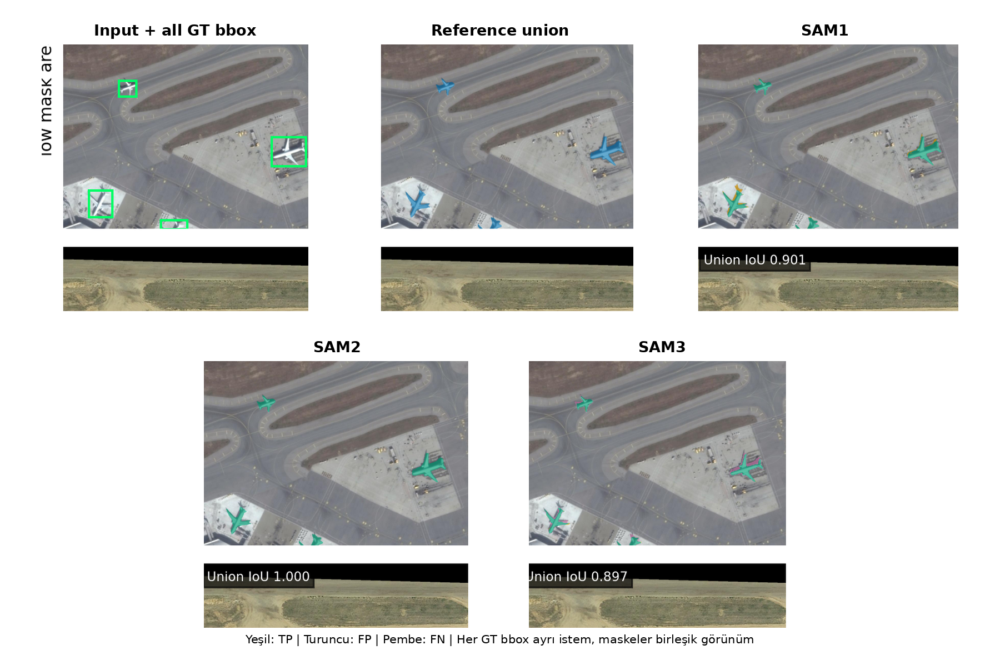
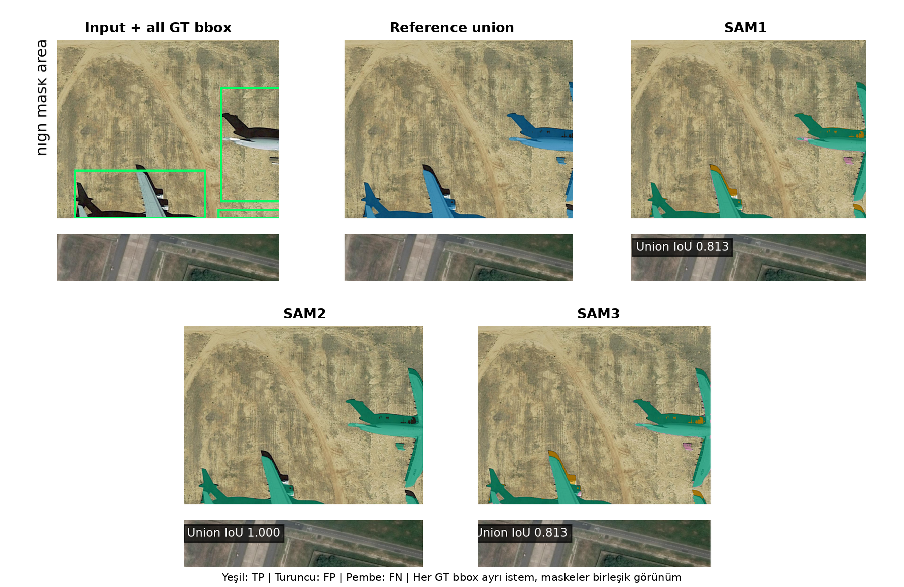
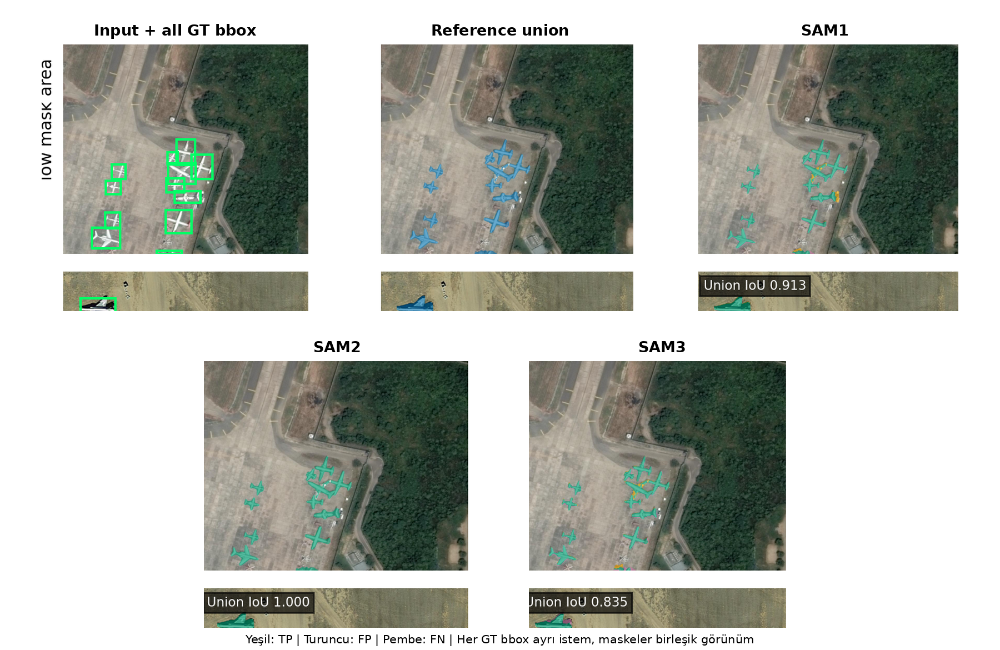
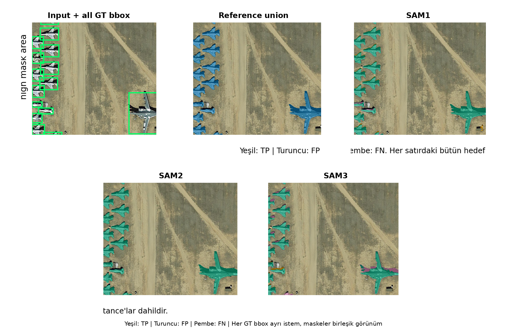

# Isaid Plane SAM2 Pseudo Reference Full Metric Document

## Scope

- Veri seti iSAID, hedef sınıf uçak ve giriş çözünürlüğü 1024×1024 pikseldir.
- Test kümesi 512 görüntüdür. Dört Overlap × Mask Area grubunun her birinde tam 128 görüntü vardır.
- No Overlap, görüntüdeki hiçbir iki insan GT bbox'un kesişmemesi; Overlap ise en az bir bbox çiftinin IoU değerinin 0,001 veya üstünde olmasıdır.
- Low/High Mask Area ayrımı insan çizimli hedef maskelerinin görüntüdeki toplam alanına göre, testten önce dondurulmuş veri setine özgü eşikle yapılmıştır. Referans değişse bile stratum üyeliği değiştirilmemiştir.
- SAM1, SAM2 ve SAM3 aynı 512 görüntüde hem GT bbox hem seed 42 YOLO bbox istemiyle çalıştırılmıştır.
- Yeni inference yapılmamıştır. İnsan, SAM1, SAM2 ve SAM3 değerlendirmelerinde aynı dondurulmuş model tahminleri kullanılmış; yalnız karşılaştırılan referans maske değiştirilmiştir.
- SAM2/SAM3 pseudo referansları ilgili öğretmenin insan GT bbox istemiyle ürettiği instance maskeleridir. İnsan kutusunun kullanılması nedeniyle bu referanslar insan lokalizasyonundan tamamen bağımsız değildir.
- Maske metrikleri instance-level hesaplanır; her hedef örnek eşit ağırlıktadır. Büyük nesneler küçük nesneleri piksel sayısıyla perdelemez.
- YOLO detector sonuçları referans maskeden bağımsızdır ve bütün pseudo raporlarda aynı gerçek bbox mAP değerleri tekrar kullanılır.

## Metric Logic

- TP, modelin doğru biçimde nesne olarak işaretlediği pikseldir. FP, nesne olmadığı hâlde nesne diye işaretlenen; FN ise nesne olduğu hâlde kaçırılan pikseldir.
- IoU = TP / (TP + FP + FN). Tahmin ve referans maskenin ortak alanını birleşim alanına böler; 1 kusursuz, 0 hiç örtüşme yok demektir.
- Dice = 2TP / (2TP + FP + FN). IoU ile aynı davranışı farklı ölçekle ifade eder.
- Precision = TP / (TP + FP). Modelin boyadığı piksellerin ne kadarının gerçekten nesne olduğunu gösterir; fazla alan boyamak precision değerini düşürür.
- Recall = TP / (TP + FN). Gerçek nesne piksellerinin ne kadarının yakalandığını gösterir; eksik maske recall değerini düşürür.
- Dört ortalama maske metriği nesne örneği düzeyinde (instance-level) önce her uçak için hesaplanır, sonra bütün örnekler eşit ağırlıkla ortalanır. Büyük nesneler küçük nesnelerin sonucunu perdelemez.
- IoU ≥ 0.50/0.75/0.90 sütunları, ilgili IoU eşiğini geçen uçak maskelerinin oranıdır. Bunlar mAP değildir ve raporda mAP gibi adlandırılmaz.
- YOLO'nun kaçırdığı bir gerçek uçak, YOLO-bbox maske tablosunda boş tahmin olarak değerlendirilir ve o örneğin maske skorları sıfır olur. Herhangi bir gerçek nesneyle eşleşmeyen yanlış pozitif YOLO kutuları ise instance maske ortalamasına sahte bir referans örneği olarak eklenmez; bunların etkisi detector Precision, Recall ve mAP değerlerinde ölçülür.
- Maske tabloları her GT uçak örneğini değerlendirir; YOLO'nun eşleştiremediği GT örnekleri de boş tahmin ve sıfır skorla hesaba katılır. Bu değerlendirme gerçek COCO segmentation AP ile aynı değildir. Confidence sırasındaki bütün maskeleri ve yanlış pozitifleri kullanan uçtan uca COCO mask AP bu raporda ayrıca çalıştırılmadığı için IoU eşik oranları AP veya mAP diye yeniden adlandırılmamıştır.
- Overall tablosu 512 görüntüyü, diğer tabloların her biri 128 görüntüyü kapsar.
- GT-bbox satırları tek sabit koşuldur. YOLO-bbox satırlarındaki değerler sabit seed 42 sonucudur.

## Dataset Context

- Bu belge bağımsız ground truth performansı değil, değerlendirme referansının model skorunu nasıl değiştirdiğini gösteren kontrollü bir referans duyarlılığı deneyidir.
- Referans öğretmeni SAM2. referans istemi insan GT bbox ve örnek sayısı 5.447.
- Referans kümesinde 0 boş maske vardır (0.0%).
- Bir öğretmenin GT-bbox tahminini aynı tahmin maskesine karşı ölçen diagonal hücre özdeşlik gereği 1,000 olur; bu sonuç model başarısı olarak yorumlanamaz.
- Detector mAP değerleri bbox ölçümüdür. Avg IoU, Dice, Precision, Recall ve IoU eşik oranları piksel maskesi ölçümüdür; IoU eşik oranları mAP değildir.

## YOLO Detector BBox Metrics

- Bu tablo yalnız YOLO detector kutularını değerlendirir; burada ölçülen bbox başarısıdır, maske başarısı değildir.
- BBox mAP50/mAP75/mAP90, tahmin kutusunun GT kutuyla sırasıyla en az 0,50/0,75/0,90 IoU yaptığı eşiklerde confidence sıralaması boyunca hesaplanan gerçek average precision değeridir.
- BBox mAP50-95, 0,50 ile 0,95 arasındaki on bbox IoU eşiğinin AP ortalamasıdır.
- BBox Precision ve Recall değerleri, doğrulama kümesinde seçilip testten önce sabitlenen güven eşiğinde hesaplanır.
- Tablodaki değerler sabit seed 42 sonucudur.

| Detector | Images | BBox mAP50 | BBox mAP75 | BBox mAP90 | BBox mAP50-95 | BBox Precision@0.50 | BBox Recall@0.50 | BBox Precision@0.75 | BBox Recall@0.75 | BBox Precision@0.90 | BBox Recall@0.90 |
| --- | --- | --- | --- | --- | --- | --- | --- | --- | --- | --- | --- |
| YOLO26x (seed 42) | 512 | 0.920 | 0.847 | 0.545 | 0.762 | 0.925 | 0.896 | 0.868 | 0.840 | 0.632 | 0.612 |

## SAM2 Pseudo Referansı

Değerlendirme SAM2 modelinin insan GT bbox istemiyle ürettiği dondurulmuş instance maskelerine karşı yapılmıştır.

### Overall

Referans: SAM2 Pseudo Referansı. Bu tablo 512 görüntüdeki 5.447 uçak örneğini kapsar. YOLO bbox değerleri sabit seed 42 sonucudur.

| Pipeline | Images | Avg IoU | Avg Dice | Avg Precision | Avg Recall | IoU ≥ 0.50 | IoU ≥ 0.75 | IoU ≥ 0.90 |
| --- | --- | --- | --- | --- | --- | --- | --- | --- |
| SAM1 GT bbox | 512 | 0.827 | 0.898 | 0.939 | 0.874 | 0.966 | 0.845 | 0.263 |
| SAM1 YOLO bbox | 512 | 0.749 | 0.811 | 0.847 | 0.788 | 0.874 | 0.776 | 0.236 |
| SAM2 GT bbox | 512 | 1.000 | 1.000 | 1.000 | 1.000 | 1.000 | 1.000 | 1.000 |
| SAM2 YOLO bbox | 512 | 0.853 | 0.871 | 0.876 | 0.871 | 0.887 | 0.860 | 0.781 |
| SAM3 GT bbox | 512 | 0.793 | 0.869 | 0.905 | 0.848 | 0.949 | 0.806 | 0.167 |
| SAM3 YOLO bbox | 512 | 0.718 | 0.785 | 0.820 | 0.761 | 0.859 | 0.732 | 0.160 |

### No Overlap × Low Mask Area

Referans: SAM2 Pseudo Referansı. Bu tablo 128 görüntüdeki 439 uçak örneğini kapsar. YOLO bbox değerleri sabit seed 42 sonucudur.

| Pipeline | Images | Avg IoU | Avg Dice | Avg Precision | Avg Recall | IoU ≥ 0.50 | IoU ≥ 0.75 | IoU ≥ 0.90 |
| --- | --- | --- | --- | --- | --- | --- | --- | --- |
| SAM1 GT bbox | 128 | 0.795 | 0.875 | 0.925 | 0.850 | 0.929 | 0.779 | 0.173 |
| SAM1 YOLO bbox | 128 | 0.719 | 0.785 | 0.824 | 0.762 | 0.845 | 0.731 | 0.166 |
| SAM2 GT bbox | 128 | 1.000 | 1.000 | 1.000 | 1.000 | 1.000 | 1.000 | 1.000 |
| SAM2 YOLO bbox | 128 | 0.828 | 0.849 | 0.854 | 0.848 | 0.861 | 0.836 | 0.738 |
| SAM3 GT bbox | 128 | 0.747 | 0.835 | 0.896 | 0.798 | 0.934 | 0.706 | 0.041 |
| SAM3 YOLO bbox | 128 | 0.678 | 0.757 | 0.816 | 0.712 | 0.847 | 0.620 | 0.025 |

### No Overlap × High Mask Area

Referans: SAM2 Pseudo Referansı. Bu tablo 128 görüntüdeki 622 uçak örneğini kapsar. YOLO bbox değerleri sabit seed 42 sonucudur.

| Pipeline | Images | Avg IoU | Avg Dice | Avg Precision | Avg Recall | IoU ≥ 0.50 | IoU ≥ 0.75 | IoU ≥ 0.90 |
| --- | --- | --- | --- | --- | --- | --- | --- | --- |
| SAM1 GT bbox | 128 | 0.820 | 0.889 | 0.900 | 0.896 | 0.957 | 0.826 | 0.310 |
| SAM1 YOLO bbox | 128 | 0.765 | 0.828 | 0.843 | 0.826 | 0.889 | 0.775 | 0.289 |
| SAM2 GT bbox | 128 | 1.000 | 1.000 | 1.000 | 1.000 | 1.000 | 1.000 | 1.000 |
| SAM2 YOLO bbox | 128 | 0.872 | 0.889 | 0.899 | 0.885 | 0.897 | 0.868 | 0.809 |
| SAM3 GT bbox | 128 | 0.796 | 0.873 | 0.931 | 0.837 | 0.957 | 0.788 | 0.166 |
| SAM3 YOLO bbox | 128 | 0.719 | 0.789 | 0.850 | 0.748 | 0.857 | 0.704 | 0.161 |

### Overlap × Low Mask Area

Referans: SAM2 Pseudo Referansı. Bu tablo 128 görüntüdeki 1.708 uçak örneğini kapsar. YOLO bbox değerleri sabit seed 42 sonucudur.

| Pipeline | Images | Avg IoU | Avg Dice | Avg Precision | Avg Recall | IoU ≥ 0.50 | IoU ≥ 0.75 | IoU ≥ 0.90 |
| --- | --- | --- | --- | --- | --- | --- | --- | --- |
| SAM1 GT bbox | 128 | 0.808 | 0.889 | 0.943 | 0.853 | 0.976 | 0.796 | 0.118 |
| SAM1 YOLO bbox | 128 | 0.728 | 0.798 | 0.845 | 0.764 | 0.877 | 0.737 | 0.109 |
| SAM2 GT bbox | 128 | 1.000 | 1.000 | 1.000 | 1.000 | 1.000 | 1.000 | 1.000 |
| SAM2 YOLO bbox | 128 | 0.840 | 0.863 | 0.870 | 0.860 | 0.886 | 0.853 | 0.750 |
| SAM3 GT bbox | 128 | 0.756 | 0.845 | 0.878 | 0.826 | 0.943 | 0.715 | 0.020 |
| SAM3 YOLO bbox | 128 | 0.679 | 0.757 | 0.795 | 0.731 | 0.851 | 0.657 | 0.016 |

### Overlap × High Mask Area

Referans: SAM2 Pseudo Referansı. Bu tablo 128 görüntüdeki 2.678 uçak örneğini kapsar. YOLO bbox değerleri sabit seed 42 sonucudur.

| Pipeline | Images | Avg IoU | Avg Dice | Avg Precision | Avg Recall | IoU ≥ 0.50 | IoU ≥ 0.75 | IoU ≥ 0.90 |
| --- | --- | --- | --- | --- | --- | --- | --- | --- |
| SAM1 GT bbox | 128 | 0.846 | 0.909 | 0.948 | 0.887 | 0.967 | 0.892 | 0.360 |
| SAM1 YOLO bbox | 128 | 0.763 | 0.820 | 0.852 | 0.800 | 0.873 | 0.808 | 0.315 |
| SAM2 GT bbox | 128 | 1.000 | 1.000 | 1.000 | 1.000 | 1.000 | 1.000 | 1.000 |
| SAM2 YOLO bbox | 128 | 0.860 | 0.876 | 0.877 | 0.878 | 0.889 | 0.866 | 0.801 |
| SAM3 GT bbox | 128 | 0.824 | 0.889 | 0.917 | 0.872 | 0.954 | 0.884 | 0.281 |
| SAM3 YOLO bbox | 128 | 0.749 | 0.806 | 0.830 | 0.791 | 0.867 | 0.804 | 0.274 |

## Reference Bias Comparison

Görüntü, instance, bbox istemi ve model tahmini aynıdır; yalnız değerlendirme referansı insan maskesinden SAM2 pseudo maskesine değişmiştir.

| Model | BBox | Human IoU | Reference IoU | IoU Farkı |
| --- | --- | --- | --- | --- |
| SAM1 | GT bbox | 0.653 | 0.827 | +0.175 |
| SAM1 | YOLO bbox | 0.597 | 0.749 | +0.152 |
| SAM2 | GT bbox | 0.629 | 1.000 | +0.371 |
| SAM2 | YOLO bbox | 0.574 | 0.853 | +0.279 |
| SAM3 | GT bbox | 0.655 | 0.793 | +0.138 |
| SAM3 | YOLO bbox | 0.595 | 0.718 | +0.123 |

## Qualitative Examples

Her sayfa bir gruptan tek görüntüyü gösterir. Görüntüdeki bütün GT uçak kutuları modele ayrı istemler olarak verilmiş ve instance maskeleri yalnız bu görsel için birleştirilmiştir. Tablolar instance-level kalır. Yeşil TP, turuncu FP ve pembe FN piksellerini gösterir.

### No Overlap / Low Mask Area

### No Overlap / High Mask Area

### Overlap / Low Mask Area

### Overlap / High Mask Area

## Discussion

- SAM2 GT-bbox diagonal kontrolü 1.000 değerindedir. Bu tam skor beklenen özdeşlik kontrolüdür.
- Aynı SAM2 modeli insan referansında GT-bbox Avg IoU 0.629 verir; referansın kendi çıktısına çevrilmesi görünürde +0.371 artış üretir.
- YOLO bbox kullanıldığında SAM2 modeli kendi pseudo referansında 0.853 Avg IoU verir; bbox değişmesine rağmen aynı model ailesine ait referans avantajı sürmektedir.
- İnsan referansı GT-bbox sıralaması SAM3 > SAM1 > SAM2; bu pseudo referans sıralaması SAM2 > SAM1 > SAM3 biçimindedir.
- 0 boş öğretmen maskesi. özellikle boş tahmin–boş referans eşleşmelerinde öz-skoru yükseltebilir. Bu nedenle boş referans oranı skorlarla birlikte raporlanmalıdır.
- Sonuç, pseudo etiketlerin kullanılamaz olduğunu değil; pseudo etiket üreticisiyle aday modelin aynı veya yakın aileden olduğu değerlendirmelerde bağımsız insan referansı olmadan model seçimi yapılamayacağını gösterir.
