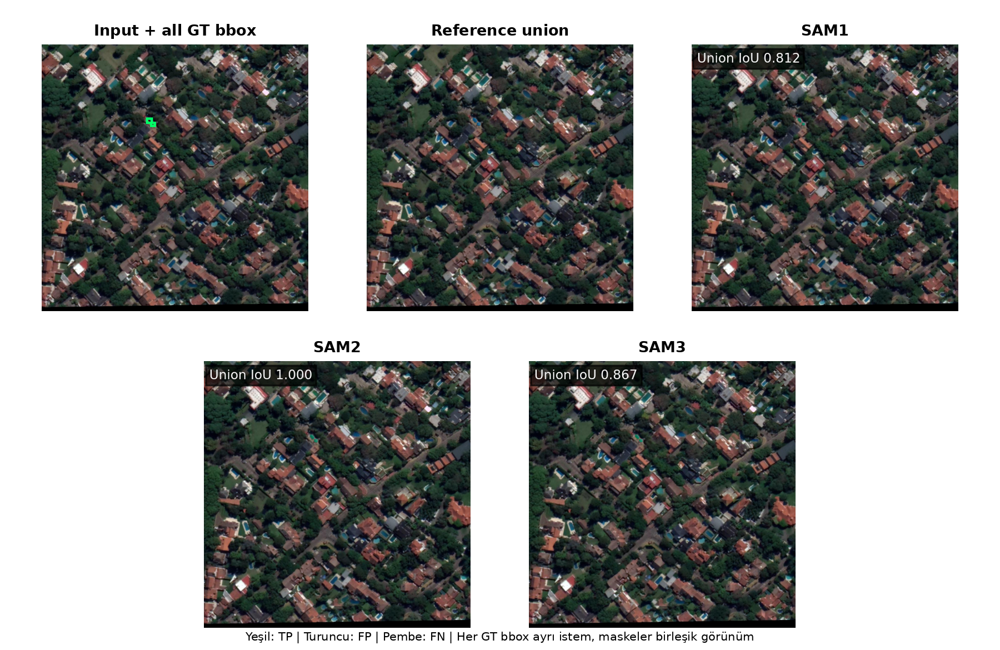
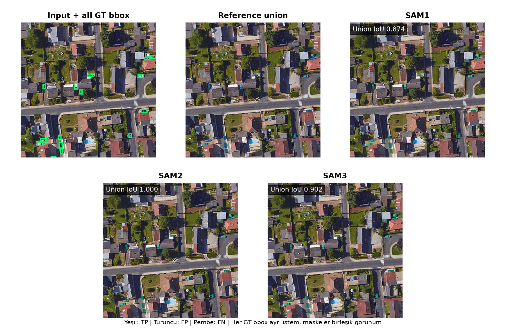
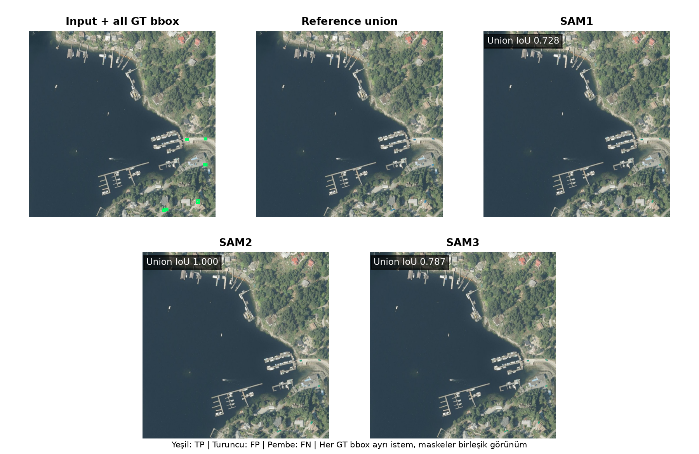
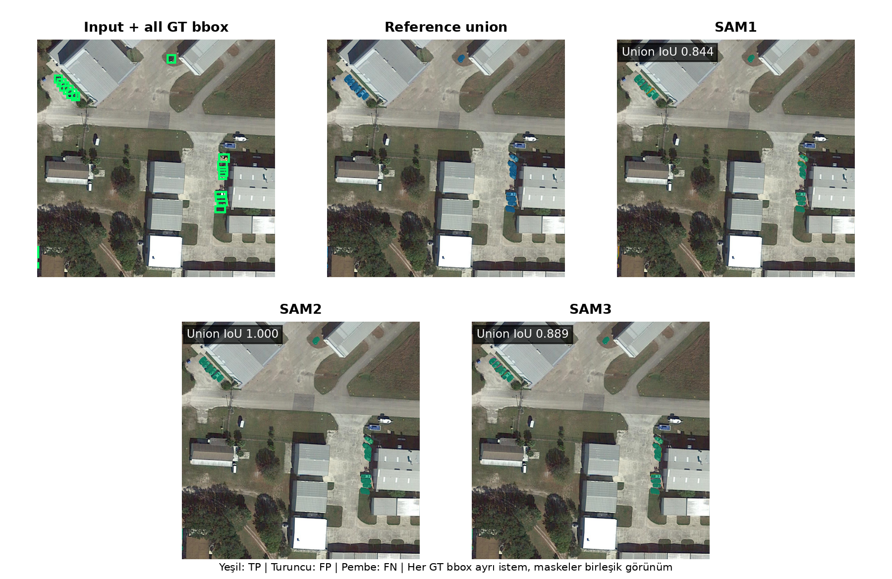

# Isaid Small Vehicle - SAM2 pseudo referansı Full Metric Document

## Scope

- Veri kaynağı iSAID, hedef sınıf küçük araç ve model giriş çözünürlüğü 1024×1024 pikseldir.
- Test kümesi 512 görüntüdür. Dört Overlap × Mask Area grubunun her birinde tam 128 görüntü vardır.
- No Overlap, görüntüdeki hedef GT bbox çiftlerinin kesişmemesi; Overlap ise en az bir hedef bbox çiftinin IoU değerinin 0,001 veya üstünde olmasıdır.
- Low/High Mask Area ayrımı yayımlanmış temel instance maskelerinin görüntü içindeki toplam alan oranına göre, testten önce dondurulmuş veri setine özgü eşikle yapılmıştır. Referans türü değişse bile stratum üyeliği değişmez.
- SAM1, SAM2 ve SAM3 tahminleri aynı 512 görüntüde hem GT bbox hem de seed 42 ile eğitilmiş YOLO bbox istemiyle bir kez üretilmiş ve bütün referanslara karşı değişmeden yeniden değerlendirilmiştir.
- SAM3 bbox koşulu Sam3Tracker PVS arayüzüyle, multimask_output=False ve mask_threshold=0.0 ayarlarıyla çalıştırılmıştır. PCS kavram örneği arayüzü kullanılmamıştır.
- Maske metrikleri instance-level hesaplanır; her hedef örnek eşit ağırlıktadır. Büyük nesneler küçük nesneleri piksel sayısıyla perdelemez.
- YOLO detector tablosu referans maskeden bağımsızdır; bütün referans raporlarında aynı dondurulmuş bbox sonuçları kullanılır.
- Nitel görsellerde seçilen görüntüdeki bütün hedef instance'lar modele ayrı GT bbox istemleri olarak verilir ve maskeler yalnız gösterim amacıyla birleştirilir.

## Metric Logic

- TP, modelin doğru biçimde nesne olarak işaretlediği pikseldir. FP, nesne olmadığı hâlde nesne diye işaretlenen; FN ise nesne olduğu hâlde kaçırılan pikseldir.
- IoU = TP / (TP + FP + FN). Tahmin ve referans maskenin ortak alanını birleşim alanına böler; 1 kusursuz, 0 hiç örtüşme yok demektir.
- Dice = 2TP / (2TP + FP + FN). IoU ile aynı davranışı farklı ölçekle ifade eder.
- Precision = TP / (TP + FP). Modelin boyadığı piksellerin ne kadarının gerçekten nesne olduğunu gösterir; fazla alan boyamak precision değerini düşürür.
- Recall = TP / (TP + FN). Gerçek nesne piksellerinin ne kadarının yakalandığını gösterir; eksik maske recall değerini düşürür.
- Dört ortalama maske metriği nesne örneği düzeyinde (instance-level) önce her küçük araç için hesaplanır, sonra bütün örnekler eşit ağırlıkla ortalanır. Büyük nesneler küçük nesnelerin sonucunu perdelemez.
- Her satırda temel veri seti anotasyonuyla varlığı bilinen bir küçük araç vardır. Bu nedenle boş pseudo referans eksik etikettir; tahmin de boş olsa bile maske metrikleri 0 kabul edilir ve referans kapsama kaybı ayrıca raporlanır.
- IoU ≥ 0.50/0.75/0.90 sütunları, ilgili IoU eşiğini geçen küçük araç maskelerinin oranıdır. Bunlar mAP değildir ve raporda mAP gibi adlandırılmaz.
- YOLO'nun kaçırdığı bir gerçek küçük araç, YOLO-bbox maske tablosunda boş tahmin olarak değerlendirilir ve o örneğin maske skorları sıfır olur. Herhangi bir gerçek nesneyle eşleşmeyen yanlış pozitif YOLO kutuları ise instance maske ortalamasına sahte bir referans örneği olarak eklenmez; bunların etkisi detector Precision, Recall ve mAP değerlerinde ölçülür.
- Maske tabloları her GT küçük araç örneğini değerlendirir; YOLO'nun eşleştiremediği GT örnekleri de boş tahmin ve sıfır skorla hesaba katılır. Bu değerlendirme gerçek COCO segmentation AP ile aynı değildir. Confidence sırasındaki bütün maskeleri ve yanlış pozitifleri kullanan uçtan uca COCO mask AP bu raporda ayrıca çalıştırılmadığı için IoU eşik oranları AP veya mAP diye yeniden adlandırılmamıştır.
- Overall tablosu 512 görüntüyü, diğer tabloların her biri 128 görüntüyü kapsar.
- GT-bbox satırları tek sabit koşuldur. YOLO-bbox satırlarındaki değerler sabit seed 42 sonucudur.

## Dataset Context

- Bu belgede değerlendirme referansı SAM2 pseudo referansı ve değerlendirilen instance sayısı 12.051.
- Referans kümesinde 0 boş maske vardır (0.00%). Bilinen pozitif nesnede boş pseudo maske başarı sayılmaz ve 0 puanlanır.
- Detector mAP değerleri bbox ölçümüdür. Avg IoU, Dice, Precision, Recall ve IoU eşik oranları piksel maskesi ölçümüdür; IoU eşik oranları mAP değildir.
- Bu pseudo referans SAM2 modeline insan/yayımlanmış GT bbox verilerek instance başına üretilmiştir; lokalizasyon kutusu referans veri setinden gelir.
- GT-bbox diagonal hücre aynı dondurulmuş tahmin ile kendi pseudo referansını karşılaştıran özdeşlik/kapsama kontrolüdür. Bu hücre bağımsız segmentasyon başarısı değildir.

## YOLO Detector BBox Metrics

- Bu tablo yalnız YOLO detector kutularını değerlendirir; burada ölçülen bbox başarısıdır, maske başarısı değildir.
- BBox mAP50/mAP75/mAP90, tahmin kutusunun GT kutuyla sırasıyla en az 0,50/0,75/0,90 IoU yaptığı eşiklerde confidence sıralaması boyunca hesaplanan gerçek average precision değeridir.
- BBox mAP50-95, 0,50 ile 0,95 arasındaki on bbox IoU eşiğinin AP ortalamasıdır.
- BBox Precision ve Recall değerleri, doğrulama kümesinde seçilip testten önce sabitlenen güven eşiğinde hesaplanır.
- Tablodaki değerler sabit seed 42 sonucudur.

| Detector | Images | BBox mAP50 | BBox mAP75 | BBox mAP90 | BBox mAP50-95 | BBox Precision@0.50 | BBox Recall@0.50 | BBox Precision@0.75 | BBox Recall@0.75 | BBox Precision@0.90 | BBox Recall@0.90 |
| --- | --- | --- | --- | --- | --- | --- | --- | --- | --- | --- | --- |
| YOLO26x (seed 42) | 512 | 0.609 | 0.358 | 0.021 | 0.346 | 0.528 | 0.716 | 0.350 | 0.474 | 0.055 | 0.075 |

## SAM2 pseudo referansı

Bütün SAM1/2/3 tahminleri değişmeden tutulmuş ve SAM2 pseudo referansı ile değerlendirilmiştir.

### Overall

Referans: SAM2 pseudo referansı. Bu tablo 512 görüntüdeki 12.051 küçük araç örneğini kapsar. YOLO bbox değerleri sabit seed 42 sonucudur.

| Pipeline | Images | Avg IoU | Avg Dice | Avg Precision | Avg Recall | IoU ≥ 0.50 | IoU ≥ 0.75 | IoU ≥ 0.90 |
| --- | --- | --- | --- | --- | --- | --- | --- | --- |
| SAM1 GT bbox | 512 | 0.749 | 0.842 | 0.898 | 0.824 | 0.906 | 0.602 | 0.186 |
| SAM1 YOLO bbox | 512 | 0.551 | 0.615 | 0.644 | 0.607 | 0.668 | 0.461 | 0.148 |
| SAM2 GT bbox | 512 | 1.000 | 1.000 | 1.000 | 1.000 | 1.000 | 1.000 | 1.000 |
| SAM2 YOLO bbox | 512 | 0.624 | 0.663 | 0.663 | 0.674 | 0.702 | 0.629 | 0.369 |
| SAM3 GT bbox | 512 | 0.771 | 0.863 | 0.916 | 0.833 | 0.952 | 0.643 | 0.165 |
| SAM3 YOLO bbox | 512 | 0.555 | 0.620 | 0.652 | 0.604 | 0.684 | 0.472 | 0.116 |

### No Overlap × Low Mask Area

Referans: SAM2 pseudo referansı. Bu tablo 128 görüntüdeki 522 küçük araç örneğini kapsar. YOLO bbox değerleri sabit seed 42 sonucudur.

| Pipeline | Images | Avg IoU | Avg Dice | Avg Precision | Avg Recall | IoU ≥ 0.50 | IoU ≥ 0.75 | IoU ≥ 0.90 |
| --- | --- | --- | --- | --- | --- | --- | --- | --- |
| SAM1 GT bbox | 128 | 0.799 | 0.881 | 0.912 | 0.873 | 0.969 | 0.755 | 0.186 |
| SAM1 YOLO bbox | 128 | 0.546 | 0.602 | 0.620 | 0.597 | 0.669 | 0.511 | 0.126 |
| SAM2 GT bbox | 128 | 1.000 | 1.000 | 1.000 | 1.000 | 1.000 | 1.000 | 1.000 |
| SAM2 YOLO bbox | 128 | 0.614 | 0.645 | 0.641 | 0.653 | 0.678 | 0.653 | 0.450 |
| SAM3 GT bbox | 128 | 0.819 | 0.897 | 0.935 | 0.871 | 0.992 | 0.818 | 0.155 |
| SAM3 YOLO bbox | 128 | 0.554 | 0.609 | 0.631 | 0.596 | 0.676 | 0.544 | 0.102 |

### No Overlap × High Mask Area

Referans: SAM2 pseudo referansı. Bu tablo 128 görüntüdeki 1.512 küçük araç örneğini kapsar. YOLO bbox değerleri sabit seed 42 sonucudur.

| Pipeline | Images | Avg IoU | Avg Dice | Avg Precision | Avg Recall | IoU ≥ 0.50 | IoU ≥ 0.75 | IoU ≥ 0.90 |
| --- | --- | --- | --- | --- | --- | --- | --- | --- |
| SAM1 GT bbox | 128 | 0.864 | 0.924 | 0.926 | 0.932 | 0.988 | 0.892 | 0.479 |
| SAM1 YOLO bbox | 128 | 0.718 | 0.768 | 0.770 | 0.773 | 0.827 | 0.742 | 0.384 |
| SAM2 GT bbox | 128 | 1.000 | 1.000 | 1.000 | 1.000 | 1.000 | 1.000 | 1.000 |
| SAM2 YOLO bbox | 128 | 0.763 | 0.793 | 0.797 | 0.794 | 0.829 | 0.787 | 0.610 |
| SAM3 GT bbox | 128 | 0.876 | 0.932 | 0.960 | 0.912 | 0.997 | 0.951 | 0.460 |
| SAM3 YOLO bbox | 128 | 0.717 | 0.768 | 0.791 | 0.751 | 0.829 | 0.761 | 0.316 |

### Overlap × Low Mask Area

Referans: SAM2 pseudo referansı. Bu tablo 128 görüntüdeki 1.582 küçük araç örneğini kapsar. YOLO bbox değerleri sabit seed 42 sonucudur.

| Pipeline | Images | Avg IoU | Avg Dice | Avg Precision | Avg Recall | IoU ≥ 0.50 | IoU ≥ 0.75 | IoU ≥ 0.90 |
| --- | --- | --- | --- | --- | --- | --- | --- | --- |
| SAM1 GT bbox | 128 | 0.692 | 0.800 | 0.861 | 0.792 | 0.860 | 0.472 | 0.064 |
| SAM1 YOLO bbox | 128 | 0.378 | 0.433 | 0.450 | 0.434 | 0.480 | 0.272 | 0.035 |
| SAM2 GT bbox | 128 | 1.000 | 1.000 | 1.000 | 1.000 | 1.000 | 1.000 | 1.000 |
| SAM2 YOLO bbox | 128 | 0.444 | 0.477 | 0.469 | 0.494 | 0.513 | 0.436 | 0.204 |
| SAM3 GT bbox | 128 | 0.728 | 0.834 | 0.879 | 0.816 | 0.920 | 0.534 | 0.071 |
| SAM3 YOLO bbox | 128 | 0.383 | 0.438 | 0.452 | 0.436 | 0.492 | 0.279 | 0.032 |

### Overlap × High Mask Area

Referans: SAM2 pseudo referansı. Bu tablo 128 görüntüdeki 8.435 küçük araç örneğini kapsar. YOLO bbox değerleri sabit seed 42 sonucudur.

| Pipeline | Images | Avg IoU | Avg Dice | Avg Precision | Avg Recall | IoU ≥ 0.50 | IoU ≥ 0.75 | IoU ≥ 0.90 |
| --- | --- | --- | --- | --- | --- | --- | --- | --- |
| SAM1 GT bbox | 128 | 0.735 | 0.833 | 0.899 | 0.808 | 0.896 | 0.566 | 0.157 |
| SAM1 YOLO bbox | 128 | 0.553 | 0.623 | 0.659 | 0.611 | 0.675 | 0.443 | 0.129 |
| SAM2 GT bbox | 128 | 1.000 | 1.000 | 1.000 | 1.000 | 1.000 | 1.000 | 1.000 |
| SAM2 YOLO bbox | 128 | 0.633 | 0.676 | 0.676 | 0.687 | 0.716 | 0.636 | 0.352 |
| SAM3 GT bbox | 128 | 0.757 | 0.853 | 0.914 | 0.819 | 0.948 | 0.598 | 0.131 |
| SAM3 YOLO bbox | 128 | 0.558 | 0.628 | 0.667 | 0.609 | 0.694 | 0.452 | 0.097 |

## Reference Bias Comparison

Görüntü, instance, bbox istemi ve model tahmini aynıdır; yalnız değerlendirme referansı İnsan referansı yerine SAM2 pseudo referansı olarak değiştirilmiştir.

| Model | BBox | Temel Referans IoU | Reference IoU | IoU Farkı |
| --- | --- | --- | --- | --- |
| SAM1 | GT bbox | 0.658 | 0.749 | +0.091 |
| SAM1 | YOLO bbox | 0.478 | 0.551 | +0.073 |
| SAM2 | GT bbox | 0.645 | 1.000 | +0.355 |
| SAM2 | YOLO bbox | 0.461 | 0.624 | +0.163 |
| SAM3 | GT bbox | 0.698 | 0.771 | +0.072 |
| SAM3 | YOLO bbox | 0.491 | 0.555 | +0.064 |

## Qualitative Examples

Her sayfa bir gruptan tek görüntüyü gösterir. Görüntüdeki bütün GT küçük araç kutuları modele ayrı istemler olarak verilmiş ve instance maskeleri yalnız bu görsel için birleştirilmiştir. Tablolar instance-level kalır. Yeşil TP, turuncu FP ve pembe FN piksellerini gösterir.

### No Overlap / Low Mask Area

### No Overlap / High Mask Area

### Overlap / Low Mask Area

### Overlap / High Mask Area

## Discussion

- Bu referansta Overall GT-bbox sıralaması SAM2 > SAM3 > SAM1; YOLO-bbox sıralaması SAM2 > SAM3 > SAM1 biçimindedir.
- GT bbox ile YOLO bbox arasındaki fark, segmenterden önceki detection hatasının uçtan uca sisteme etkisini gösterir.
- SAM2 modeli YOLO bbox koşulunda temel referansa karşı 0.461, kendi öğretmen ailesinin referansına karşı 0.624 Avg IoU verir; görünür fark +0.163'tür.
- Kendi pseudo referansında yüksek skor, modelin gerçek dünyada daha doğru olduğunu tek başına kanıtlamaz; aynı model ailesinin benzer sınır ve hata tercihlerini ödüllendiren teacher-reference affinity etkisini gösterebilir.
- Ana sonuç yalnız Overall tablosuna dayandırılmamalıdır; aynı yönün dört Overlap × Mask Area tabakasında korunup korunmadığı deney içi çapraz analiz belgesinde ayrıca gösterilir.
