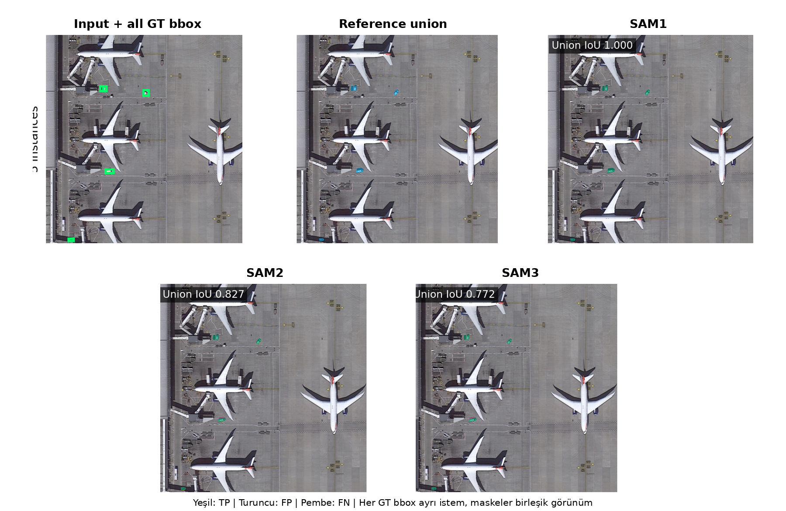
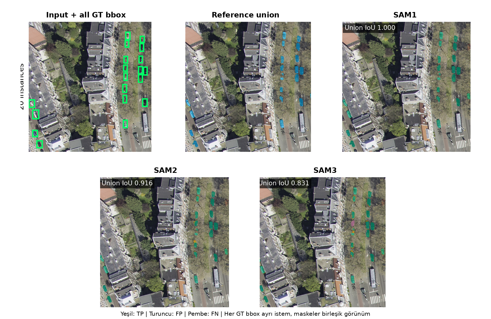
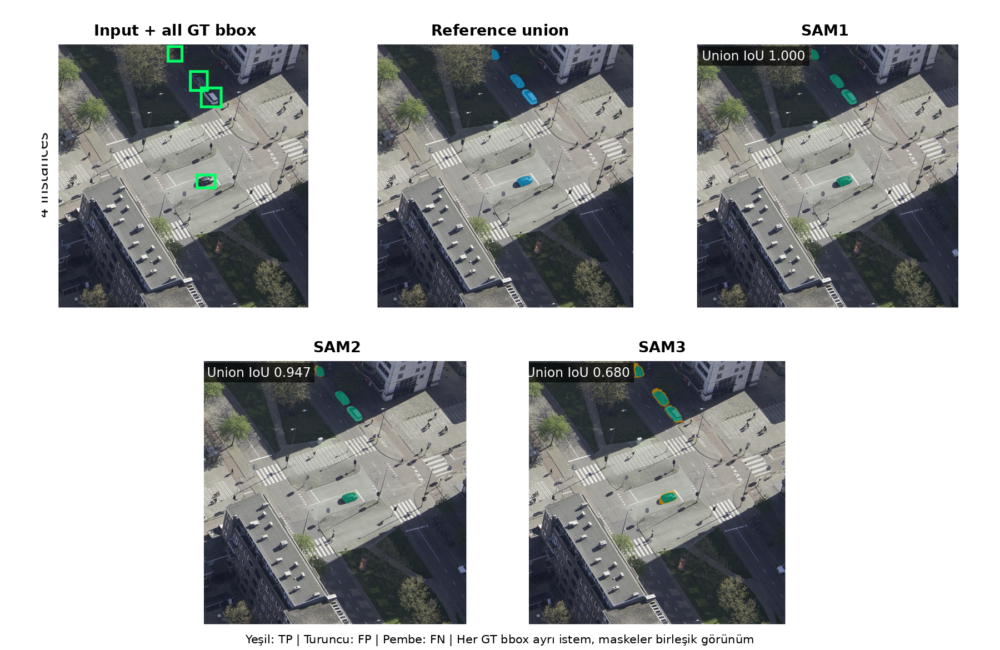
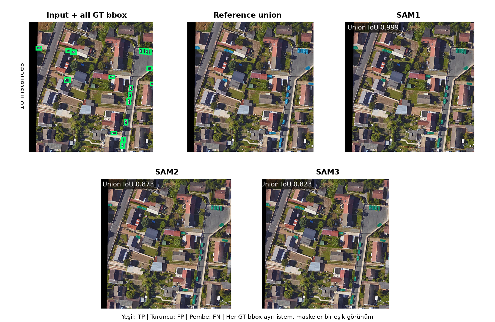

# SAMRS SOTA Small Vehicle Full Metric Document

## Scope

- Veri seti SAMRS SOTA-RBB, hedef sınıf small-vehicle ve model giriş çözünürlüğü 1024×1024 pikseldir.
- Test kümesi 512 görüntüdür. Dört overlap × mask-area grubunun her birinde tam 128 görüntü vardır.
- Strata tanımı gereği 512 test görüntüsünün tamamında en az bir küçük araç vardır; detector tablosu negatif arka plan görüntülerini içeren resmi tam benchmark değil, bu dengeli pozitif test alt kümesindeki gerçek COCO bbox değerlendirmesidir.
- No Overlap, görüntüdeki hiçbir iki GT bbox'un kesişmemesi; Overlap ise en az bir bbox çiftinin IoU değerinin 0,001 veya üstünde olmasıdır.
- Low/High Mask Area ayrımı, görüntüdeki toplam SAMRS pseudo küçük araç maskesi alanının veri seti için testten önce dondurulan eşiğin altında veya üstünde olmasına göre yapılır.
- SAM1, SAM2 ve SAM3 aynı görüntülerde hem GT bbox hem YOLO bbox istemiyle çalıştırılmıştır.
- YOLO detector her veri setinde ayrıca eğitilmiştir; SAM1, SAM2 ve SAM3 bu veri setlerinde yeniden eğitilmeden veya ince ayar yapılmadan yalnız bbox istemiyle kullanılmıştır.
- Detector protokolü aynı olsa da iSAID eğitim bölümü 5.930, SAMRS eğitim bölümü 7.824 görüntüdür; bu nedenle veri setleri arasındaki detector skoru farkı yalnız referans kaynağına bağlanan kontrollü bir etki değildir.
- YOLO bbox sonuçları deney başlamadan önce sabitlenen seed 42 ile eğitilmiş tek YOLO26x detector sonucudur.
- Maske metrikleri küçük araç örneği düzeyinde hesaplanır; büyük nesneler küçük nesnelerin sonucunu piksel sayısıyla baskılamaz.

## Metric Logic

- TP, modelin doğru biçimde nesne olarak işaretlediği pikseldir. FP, nesne olmadığı hâlde nesne diye işaretlenen; FN ise nesne olduğu hâlde kaçırılan pikseldir.
- IoU = TP / (TP + FP + FN). Tahmin ve referans maskenin ortak alanını birleşim alanına böler; 1 kusursuz, 0 hiç örtüşme yok demektir.
- Dice = 2TP / (2TP + FP + FN). IoU ile aynı davranışı farklı ölçekle ifade eder.
- Precision = TP / (TP + FP). Modelin boyadığı piksellerin ne kadarının gerçekten nesne olduğunu gösterir; fazla alan boyamak precision değerini düşürür.
- Recall = TP / (TP + FN). Gerçek nesne piksellerinin ne kadarının yakalandığını gösterir; eksik maske recall değerini düşürür.
- Dört ortalama maske metriği nesne örneği düzeyinde (instance-level) önce her küçük araç için hesaplanır, sonra bütün örnekler eşit ağırlıkla ortalanır. Büyük nesneler küçük nesnelerin sonucunu perdelemez.
- IoU ≥ 0.50/0.75/0.90 sütunları, ilgili IoU eşiğini geçen küçük araç maskelerinin oranıdır. Bunlar mAP değildir ve raporda mAP gibi adlandırılmaz.
- YOLO'nun kaçırdığı bir gerçek küçük araç, YOLO-bbox maske tablosunda boş tahmin olarak değerlendirilir ve o örneğin maske skorları sıfır olur. Herhangi bir gerçek nesneyle eşleşmeyen yanlış pozitif YOLO kutuları ise instance maske ortalamasına sahte bir referans örneği olarak eklenmez; bunların etkisi detector Precision, Recall ve mAP değerlerinde ölçülür.
- Maske tabloları her GT küçük araç örneğini değerlendirir; YOLO'nun eşleştiremediği GT örnekleri de boş tahmin ve sıfır skorla hesaba katılır. Bu değerlendirme gerçek COCO segmentation AP ile aynı değildir. Confidence sırasındaki bütün maskeleri ve yanlış pozitifleri kullanan uçtan uca COCO mask AP bu raporda ayrıca çalıştırılmadığı için IoU eşik oranları AP veya mAP diye yeniden adlandırılmamıştır.
- Overall tablosu 512 görüntüyü, diğer tabloların her biri 128 görüntüyü kapsar.
- GT-bbox satırları tek sabit koşuldur. YOLO-bbox satırlarındaki değerler sabit seed 42 sonucudur.

## Dataset Context

- SAMRS SOTA-RBB görüntüleri DOTA v2.0 remote-sensing sahnelerinden gelir.
- SAMRS veri seti ve üretim kodu kaynağı: https://github.com/ViTAE-Transformer/SAMRS
- SAMRS: Scaling-up Remote Sensing Segmentation Dataset with Segment Anything Model makalesi: https://arxiv.org/abs/2305.02034
- Yayımlanan segmentasyon maskeleri, mevcut detection istemleri SAM1 ViT-H modeline verilerek otomatik üretilmiştir.
- Bu rapordaki GT bbox, yayımlanan özgün SAMRS detection anotasyonudur; pseudo maskeden yeniden türetilmemiştir.
- Bu nedenle raporlanan maske başarısı insan çizimli bağımsız ground truth değil, SAM1 kaynaklı pseudo referansa uyumdur.
- Detector mAP değerleri bbox ölçümüdür. IoU, Dice, Precision ve Recall ise piksel maskesi ölçümüdür.

## YOLO Detector BBox Metrics

- Bu tablo yalnız YOLO detector kutularını değerlendirir; burada ölçülen bbox başarısıdır, maske başarısı değildir.
- BBox mAP50/mAP75/mAP90, tahmin kutusunun GT kutuyla sırasıyla en az 0,50/0,75/0,90 IoU yaptığı eşiklerde confidence sıralaması boyunca hesaplanan gerçek average precision değeridir.
- BBox mAP50-95, 0,50 ile 0,95 arasındaki on bbox IoU eşiğinin AP ortalamasıdır.
- BBox Precision ve Recall değerleri, doğrulama kümesinde seçilip testten önce sabitlenen güven eşiğinde hesaplanır.
- Tablodaki değerler sabit seed 42 sonucudur.

| Detector | Images | BBox mAP50 | BBox mAP75 | BBox mAP90 | BBox mAP50-95 | BBox Precision@0.50 | BBox Recall@0.50 | BBox Precision@0.75 | BBox Recall@0.75 | BBox Precision@0.90 | BBox Recall@0.90 |
| --- | --- | --- | --- | --- | --- | --- | --- | --- | --- | --- | --- |
| YOLO26x (seed 42) | 512 | 0.819 | 0.534 | 0.072 | 0.502 | 0.720 | 0.824 | 0.529 | 0.605 | 0.131 | 0.150 |

## Resmi SAMRS SAM1 Pseudo Referansı

SAMRS SOTA maskeleri SAM1 ViT-H ve özgün detection istemlerinden üretilmiş pseudo maskelerdir.

### Overall

Referans: Resmi SAMRS SAM1 Pseudo Referansı. Bu tablo 512 görüntüdeki 7.659 küçük araç örneğini kapsar. YOLO bbox değerleri sabit seed 42 sonucudur.

| Pipeline | Images | Avg IoU | Avg Dice | Avg Precision | Avg Recall | IoU ≥ 0.50 | IoU ≥ 0.75 | IoU ≥ 0.90 |
| --- | --- | --- | --- | --- | --- | --- | --- | --- |
| SAM1 GT bbox | 512 | 0.998 | 0.999 | 1.000 | 0.999 | 1.000 | 0.999 | 0.998 |
| SAM1 YOLO bbox | 512 | 0.782 | 0.801 | 0.807 | 0.798 | 0.819 | 0.800 | 0.714 |
| SAM2 GT bbox | 512 | 0.846 | 0.911 | 0.892 | 0.945 | 0.978 | 0.831 | 0.427 |
| SAM2 YOLO bbox | 512 | 0.707 | 0.757 | 0.752 | 0.772 | 0.809 | 0.714 | 0.369 |
| SAM3 GT bbox | 512 | 0.685 | 0.765 | 0.722 | 0.829 | 0.854 | 0.612 | 0.062 |
| SAM3 YOLO bbox | 512 | 0.560 | 0.627 | 0.594 | 0.676 | 0.705 | 0.500 | 0.035 |

### No Overlap × Low Mask Area

Referans: Resmi SAMRS SAM1 Pseudo Referansı. Bu tablo 128 görüntüdeki 596 küçük araç örneğini kapsar. YOLO bbox değerleri sabit seed 42 sonucudur.

| Pipeline | Images | Avg IoU | Avg Dice | Avg Precision | Avg Recall | IoU ≥ 0.50 | IoU ≥ 0.75 | IoU ≥ 0.90 |
| --- | --- | --- | --- | --- | --- | --- | --- | --- |
| SAM1 GT bbox | 128 | 0.999 | 0.999 | 1.000 | 0.999 | 1.000 | 1.000 | 0.997 |
| SAM1 YOLO bbox | 128 | 0.616 | 0.631 | 0.637 | 0.627 | 0.648 | 0.641 | 0.554 |
| SAM2 GT bbox | 128 | 0.817 | 0.891 | 0.865 | 0.944 | 0.955 | 0.800 | 0.305 |
| SAM2 YOLO bbox | 128 | 0.556 | 0.597 | 0.603 | 0.595 | 0.646 | 0.586 | 0.218 |
| SAM3 GT bbox | 128 | 0.732 | 0.827 | 0.801 | 0.876 | 0.933 | 0.597 | 0.040 |
| SAM3 YOLO bbox | 128 | 0.495 | 0.556 | 0.556 | 0.566 | 0.634 | 0.430 | 0.025 |

### No Overlap × High Mask Area

Referans: Resmi SAMRS SAM1 Pseudo Referansı. Bu tablo 128 görüntüdeki 1.478 küçük araç örneğini kapsar. YOLO bbox değerleri sabit seed 42 sonucudur.

| Pipeline | Images | Avg IoU | Avg Dice | Avg Precision | Avg Recall | IoU ≥ 0.50 | IoU ≥ 0.75 | IoU ≥ 0.90 |
| --- | --- | --- | --- | --- | --- | --- | --- | --- |
| SAM1 GT bbox | 128 | 0.999 | 0.999 | 1.000 | 0.999 | 0.999 | 0.999 | 0.999 |
| SAM1 YOLO bbox | 128 | 0.809 | 0.820 | 0.819 | 0.824 | 0.833 | 0.822 | 0.775 |
| SAM2 GT bbox | 128 | 0.904 | 0.946 | 0.945 | 0.955 | 0.988 | 0.938 | 0.702 |
| SAM2 YOLO bbox | 128 | 0.762 | 0.795 | 0.796 | 0.799 | 0.833 | 0.798 | 0.608 |
| SAM3 GT bbox | 128 | 0.804 | 0.885 | 0.832 | 0.962 | 0.976 | 0.781 | 0.143 |
| SAM3 YOLO bbox | 128 | 0.661 | 0.731 | 0.684 | 0.799 | 0.819 | 0.612 | 0.086 |

### Overlap × Low Mask Area

Referans: Resmi SAMRS SAM1 Pseudo Referansı. Bu tablo 128 görüntüdeki 1.884 küçük araç örneğini kapsar. YOLO bbox değerleri sabit seed 42 sonucudur.

| Pipeline | Images | Avg IoU | Avg Dice | Avg Precision | Avg Recall | IoU ≥ 0.50 | IoU ≥ 0.75 | IoU ≥ 0.90 |
| --- | --- | --- | --- | --- | --- | --- | --- | --- |
| SAM1 GT bbox | 128 | 0.998 | 0.999 | 0.999 | 0.999 | 1.000 | 0.999 | 0.998 |
| SAM1 YOLO bbox | 128 | 0.672 | 0.694 | 0.702 | 0.689 | 0.717 | 0.697 | 0.575 |
| SAM2 GT bbox | 128 | 0.797 | 0.881 | 0.856 | 0.926 | 0.974 | 0.725 | 0.178 |
| SAM2 YOLO bbox | 128 | 0.581 | 0.639 | 0.636 | 0.655 | 0.703 | 0.554 | 0.120 |
| SAM3 GT bbox | 128 | 0.677 | 0.770 | 0.737 | 0.823 | 0.869 | 0.540 | 0.015 |
| SAM3 YOLO bbox | 128 | 0.497 | 0.562 | 0.547 | 0.590 | 0.636 | 0.419 | 0.007 |

### Overlap × High Mask Area

Referans: Resmi SAMRS SAM1 Pseudo Referansı. Bu tablo 128 görüntüdeki 3.701 küçük araç örneğini kapsar. YOLO bbox değerleri sabit seed 42 sonucudur.

| Pipeline | Images | Avg IoU | Avg Dice | Avg Precision | Avg Recall | IoU ≥ 0.50 | IoU ≥ 0.75 | IoU ≥ 0.90 |
| --- | --- | --- | --- | --- | --- | --- | --- | --- |
| SAM1 GT bbox | 128 | 0.998 | 0.999 | 1.000 | 0.998 | 1.000 | 0.999 | 0.997 |
| SAM1 YOLO bbox | 128 | 0.854 | 0.875 | 0.883 | 0.870 | 0.893 | 0.869 | 0.786 |
| SAM2 GT bbox | 128 | 0.853 | 0.915 | 0.894 | 0.951 | 0.979 | 0.848 | 0.463 |
| SAM2 YOLO bbox | 128 | 0.774 | 0.828 | 0.817 | 0.849 | 0.880 | 0.784 | 0.424 |
| SAM3 GT bbox | 128 | 0.633 | 0.705 | 0.658 | 0.771 | 0.785 | 0.584 | 0.057 |
| SAM3 YOLO bbox | 128 | 0.562 | 0.629 | 0.587 | 0.689 | 0.705 | 0.509 | 0.031 |

## Qualitative Examples

Her sayfa bir gruptan tek görüntüyü gösterir. Görüntüdeki bütün GT küçük araç kutuları modele ayrı istemler olarak verilmiş ve instance maskeleri yalnız bu görsel için birleştirilmiştir. Tablolar instance-level kalır. Yeşil TP, turuncu FP ve pembe FN piksellerini gösterir.

### No Overlap / Low Mask Area

### No Overlap / High Mask Area

### Overlap / Low Mask Area

### Overlap / High Mask Area

## Discussion

- Resmi SAMRS pseudo referansında GT-bbox Overall IoU değerleri SAM1/SAM2/SAM3 sırasıyla 0,998/0,846/0,685 olarak ölçülmüştür.
- YOLO-bbox Overall IoU değerleri SAM1/SAM2/SAM3 sırasıyla 0,782/0,707/0,560 olarak ölçülmüştür; bunlar sabit seed 42 detector sonuçlarıdır.
- GT bbox yerine YOLO bbox kullanıldığında Overall IoU kaybı SAM1/SAM2/SAM3 için sırasıyla 0,216/0,139/0,125 olmuştur.
- SAM1'in GT-bbox IoU değeri, SAM2 ve SAM3 ortalamasından 0.233 daha yüksektir; bu fark resmi referansın SAM1 ile üretilmiş olmasıyla birlikte yorumlanmalıdır.
- SAMRS maskeleri ayrı bir resmi üretim hattında SAM1 ViT-H ile oluşturulduğu için buradaki SAM1 satırı kontrollü iSAID kimlik kontrolü kadar birebir değildir; yine de aynı model ailesine çok güçlü yakınlık gösterir.
- GT-bbox üç-model ortalamasında en yüksek alt grup No Overlap × High Mask Area (0.902), en düşük alt grup Overlap × Low Mask Area (0.824) olmuştur.
- SAM1 gt bbox koşulunda Overall Precision 1.000, Recall 0.999 olmuştur. Precision daha yüksek olduğu için model boyadığı bölgelerde daha temizdir; buna karşılık bazı gerçek nesne piksellerini eksik bırakmaktadır.
- SAM1'in yüksek skoru, aynı model ailesinin ürettiği pseudo maskelere biçimsel yakınlık içerebilir; tek başına insan etiketli gerçek performans kanıtı değildir.
- GT bbox ile YOLO bbox arasındaki fark, otomatik detector hatasının segmentasyon zincirine eklediği kaybı gösterir.
- SAMRS pseudo etiketleri eğitim ve ölçeklenebilir ön-etiketleme için yararlı olabilir; nihai model karşılaştırması bağımsız insan etiketli test kümesiyle yapılmalıdır.
