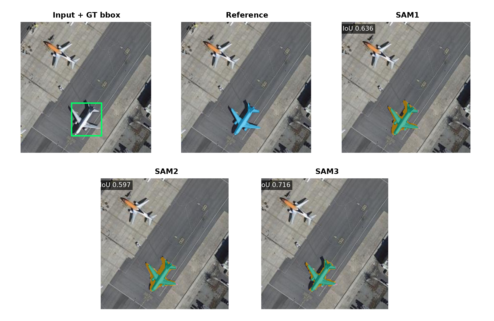
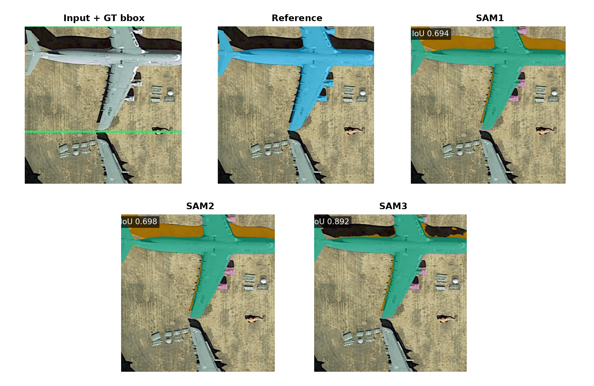
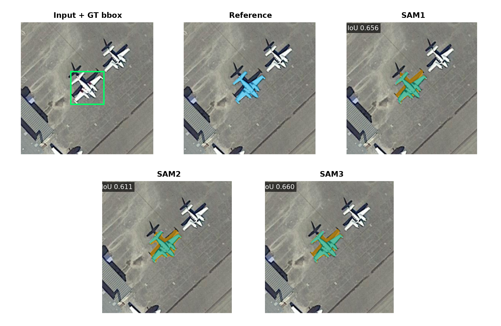
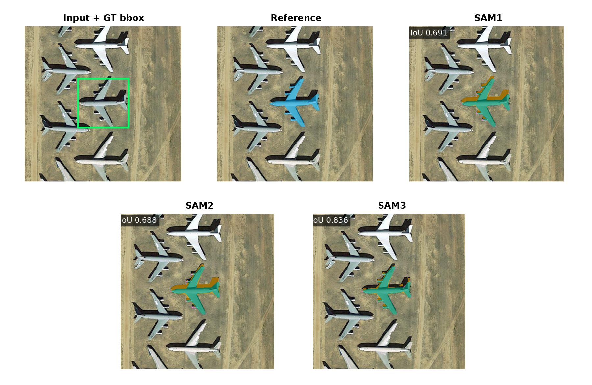

# iSAID Plane Segmentation Metric Report

## Scope

- Veri seti iSAID, hedef sınıf plane ve giriş çözünürlüğü 1024×1024'tür.
- Test kümesinde 128 görüntü vardır. Overall tablosu 128 görüntüyü, dört overlap × mask-area tablosunun her biri 32 görüntüyü kapsar.
- SAM1, SAM2 ve SAM3 aynı görüntülerde hem resmi GT bbox hem YOLO bbox ile çalıştırılmıştır.
- YOLO bbox sonuçları üç ayrı YOLO eğitiminin ortalaması ± standart sapmasıdır.
- Birincil referans iSAID'ın insan çizimli maskesidir. Aynı tahminler ayrıca kontrollü SAM1 pseudo maskesine karşı ölçülerek referans yanlılığı gösterilir.

## Metric Logic

- TP, modelin doğru biçimde nesne olarak işaretlediği pikseldir. FP, nesne olmadığı hâlde nesne diye işaretlenen; FN ise nesne olduğu hâlde kaçırılan pikseldir.
- IoU = TP / (TP + FP + FN). Tahmin ve referans maskenin ortak alanını birleşim alanına böler; 1 kusursuz, 0 hiç örtüşme yok demektir.
- Dice = 2TP / (2TP + FP + FN). IoU ile aynı davranışı farklı ölçekle ifade eder.
- Precision = TP / (TP + FP). Modelin boyadığı piksellerin ne kadarının gerçekten nesne olduğunu gösterir; fazla alan boyamak precision değerini düşürür.
- Recall = TP / (TP + FN). Gerçek nesne piksellerinin ne kadarının yakalandığını gösterir; eksik maske recall değerini düşürür.
- Dört ortalama maske metriği nesne örneği düzeyinde (instance-level) önce her uçak için hesaplanır, sonra bütün uçaklar eşit ağırlıkla ortalanır. Büyük uçaklar küçük uçakların sonucunu perdelemez.
- IoU ≥ 0.50/0.75/0.90 sütunları, ilgili IoU eşiğini geçen uçak maskelerinin oranıdır. Bunlar mAP değildir ve raporda mAP gibi adlandırılmaz.
- Maske tablolarında gerçek COCO mask AP gösterilmez. Deney bütün eşleşmemiş detector maskelerini AP biçiminde saklamadığı için eksik tahminlerden uydurma bir mask mAP hesaplanmamıştır.
- Overall tablosu 128 görüntüyü, diğer tabloların her biri 32 görüntüyü kapsar.
- GT-bbox satırları tek sabit koşuldur. YOLO-bbox satırlarındaki değerler üç ayrı YOLO eğitiminin ortalaması ± standart sapmasıdır.

## Dataset Context

- iSAID maskeleri insanlar tarafından çizildiği için bağımsız değerlendirme referansıdır.
- Kontrollü pseudo referans, iSAID görüntülerindeki resmi GT bbox'lar SAM1'e verilerek üretilmiştir; insan maskelerinin yerine geçirilmemiştir.
- İnsan ve pseudo tablolarında görüntü, bbox ve model tahmini aynıdır. Yalnız karşılaştırılan referans maske değişir.
- SAM1'in kendi ürettiği pseudo maskeye karşı çok yüksek görünmesi beklenen bir teacher-reference bias etkisidir; modelin insan maskesinde kusursuz olduğu anlamına gelmez.
- Detector mAP değerleri bbox ölçümüdür. Segmentasyon tablolarındaki IoU, Dice, Precision ve Recall ise piksel maskesi ölçümüdür.

## YOLO Detector BBox Metrics

- Bu tablo yalnız YOLO detector kutularını değerlendirir; burada ölçülen bbox başarısıdır, maske başarısı değildir.
- BBox mAP50/mAP75/mAP90, tahmin kutusunun GT kutuyla sırasıyla en az 0,50/0,75/0,90 IoU yaptığı eşiklerde confidence sıralaması boyunca hesaplanan gerçek average precision değeridir.
- BBox mAP50-95, 0,50 ile 0,95 arasındaki on bbox IoU eşiğinin AP ortalamasıdır.
- BBox Precision ve Recall değerleri, doğrulama kümesinde seçilip testten önce sabitlenen güven eşiğinde hesaplanır.
- Tablodaki değerler üç ayrı YOLO eğitiminin ortalaması ± standart sapmasıdır.

| Detector | Images | BBox mAP50 | BBox mAP75 | BBox mAP90 | BBox mAP50-95 | BBox Precision@0.50 | BBox Recall@0.50 | BBox Precision@0.75 | BBox Recall@0.75 | BBox Precision@0.90 | BBox Recall@0.90 |
| --- | --- | --- | --- | --- | --- | --- | --- | --- | --- | --- | --- |
| YOLO26x (3 seed) | 128 | 0.936 ± 0.004 | 0.862 ± 0.005 | 0.622 ± 0.008 | 0.795 ± 0.001 | 0.939 ± 0.005 | 0.903 ± 0.006 | 0.889 ± 0.004 | 0.855 ± 0.006 | 0.690 ± 0.006 | 0.663 ± 0.002 |

## İnsan Referansı

Birincil değerlendirme resmi iSAID insan çizimli instance maskelerine karşı yapılmıştır.

### Overall

| Pipeline | Images | Avg IoU | Avg Dice | Avg Precision | Avg Recall | IoU ≥ 0.50 | IoU ≥ 0.75 | IoU ≥ 0.90 |
| --- | --- | --- | --- | --- | --- | --- | --- | --- |
| SAM1 GT bbox | 128 | 0.661 | 0.787 | 0.692 | 0.943 | 0.922 | 0.198 | 0.002 |
| SAM1 YOLO bbox | 128 | 0.607 ± 0.003 | 0.721 ± 0.004 | 0.633 ± 0.003 | 0.853 ± 0.007 | 0.849 ± 0.006 | 0.178 ± 0.001 | 0.001 ± 0.000 |
| SAM2 GT bbox | 128 | 0.650 | 0.777 | 0.673 | 0.955 | 0.912 | 0.200 | 0.007 |
| SAM2 YOLO bbox | 128 | 0.596 ± 0.002 | 0.711 ± 0.003 | 0.615 ± 0.002 | 0.865 ± 0.006 | 0.833 ± 0.003 | 0.176 ± 0.003 | 0.006 ± 0.002 |
| SAM3 GT bbox | 128 | 0.667 | 0.776 | 0.696 | 0.897 | 0.900 | 0.367 | 0.009 |
| SAM3 YOLO bbox | 128 | 0.626 ± 0.003 | 0.728 ± 0.004 | 0.652 ± 0.003 | 0.838 ± 0.007 | 0.844 ± 0.006 | 0.335 ± 0.005 | 0.010 ± 0.002 |

### No Overlap × Low Mask Area

| Pipeline | Images | Avg IoU | Avg Dice | Avg Precision | Avg Recall | IoU ≥ 0.50 | IoU ≥ 0.75 | IoU ≥ 0.90 |
| --- | --- | --- | --- | --- | --- | --- | --- | --- |
| SAM1 GT bbox | 32 | 0.621 | 0.758 | 0.660 | 0.931 | 0.870 | 0.091 | 0.000 |
| SAM1 YOLO bbox | 32 | 0.587 ± 0.002 | 0.715 ± 0.004 | 0.624 ± 0.003 | 0.873 ± 0.009 | 0.827 ± 0.007 | 0.095 ± 0.007 | 0.000 ± 0.000 |
| SAM2 GT bbox | 32 | 0.619 | 0.753 | 0.652 | 0.941 | 0.870 | 0.182 | 0.000 |
| SAM2 YOLO bbox | 32 | 0.588 ± 0.005 | 0.713 ± 0.006 | 0.619 ± 0.006 | 0.886 ± 0.008 | 0.814 ± 0.015 | 0.190 ± 0.027 | 0.000 ± 0.000 |
| SAM3 GT bbox | 32 | 0.667 | 0.786 | 0.709 | 0.906 | 0.922 | 0.312 | 0.000 |
| SAM3 YOLO bbox | 32 | 0.635 ± 0.009 | 0.751 ± 0.010 | 0.675 ± 0.009 | 0.869 ± 0.013 | 0.887 ± 0.007 | 0.290 ± 0.020 | 0.013 ± 0.000 |

### No Overlap × High Mask Area

| Pipeline | Images | Avg IoU | Avg Dice | Avg Precision | Avg Recall | IoU ≥ 0.50 | IoU ≥ 0.75 | IoU ≥ 0.90 |
| --- | --- | --- | --- | --- | --- | --- | --- | --- |
| SAM1 GT bbox | 32 | 0.671 | 0.794 | 0.711 | 0.929 | 0.930 | 0.266 | 0.000 |
| SAM1 YOLO bbox | 32 | 0.636 ± 0.005 | 0.750 ± 0.006 | 0.668 ± 0.006 | 0.875 ± 0.007 | 0.885 ± 0.012 | 0.229 ± 0.005 | 0.000 ± 0.000 |
| SAM2 GT bbox | 32 | 0.684 | 0.799 | 0.712 | 0.939 | 0.922 | 0.297 | 0.047 |
| SAM2 YOLO bbox | 32 | 0.652 ± 0.007 | 0.761 ± 0.007 | 0.677 ± 0.007 | 0.891 ± 0.009 | 0.883 ± 0.016 | 0.271 ± 0.012 | 0.042 ± 0.016 |
| SAM3 GT bbox | 32 | 0.741 | 0.839 | 0.786 | 0.931 | 0.922 | 0.547 | 0.070 |
| SAM3 YOLO bbox | 32 | 0.697 ± 0.005 | 0.788 ± 0.009 | 0.737 ± 0.004 | 0.865 ± 0.021 | 0.885 ± 0.005 | 0.500 ± 0.023 | 0.073 ± 0.016 |

### Overlap × Low Mask Area

| Pipeline | Images | Avg IoU | Avg Dice | Avg Precision | Avg Recall | IoU ≥ 0.50 | IoU ≥ 0.75 | IoU ≥ 0.90 |
| --- | --- | --- | --- | --- | --- | --- | --- | --- |
| SAM1 GT bbox | 32 | 0.630 | 0.761 | 0.665 | 0.935 | 0.868 | 0.171 | 0.000 |
| SAM1 YOLO bbox | 32 | 0.519 ± 0.010 | 0.620 ± 0.012 | 0.545 ± 0.010 | 0.738 ± 0.016 | 0.721 ± 0.021 | 0.161 ± 0.007 | 0.000 ± 0.000 |
| SAM2 GT bbox | 32 | 0.612 | 0.749 | 0.644 | 0.940 | 0.878 | 0.118 | 0.000 |
| SAM2 YOLO bbox | 32 | 0.497 ± 0.010 | 0.604 ± 0.012 | 0.519 ± 0.011 | 0.741 ± 0.014 | 0.702 ± 0.016 | 0.095 ± 0.004 | 0.000 ± 0.000 |
| SAM3 GT bbox | 32 | 0.568 | 0.680 | 0.597 | 0.807 | 0.801 | 0.188 | 0.000 |
| SAM3 YOLO bbox | 32 | 0.507 ± 0.010 | 0.604 ± 0.012 | 0.533 ± 0.011 | 0.709 ± 0.015 | 0.693 ± 0.016 | 0.185 ± 0.003 | 0.000 ± 0.000 |

### Overlap × High Mask Area

| Pipeline | Images | Avg IoU | Avg Dice | Avg Precision | Avg Recall | IoU ≥ 0.50 | IoU ≥ 0.75 | IoU ≥ 0.90 |
| --- | --- | --- | --- | --- | --- | --- | --- | --- |
| SAM1 GT bbox | 32 | 0.681 | 0.803 | 0.706 | 0.951 | 0.957 | 0.212 | 0.004 |
| SAM1 YOLO bbox | 32 | 0.649 ± 0.001 | 0.767 ± 0.001 | 0.672 ± 0.001 | 0.905 ± 0.002 | 0.910 ± 0.002 | 0.186 ± 0.003 | 0.002 ± 0.000 |
| SAM2 GT bbox | 32 | 0.666 | 0.790 | 0.682 | 0.968 | 0.933 | 0.222 | 0.002 |
| SAM2 YOLO bbox | 32 | 0.636 ± 0.000 | 0.754 ± 0.000 | 0.651 ± 0.000 | 0.921 ± 0.003 | 0.893 ± 0.002 | 0.194 ± 0.003 | 0.002 ± 0.001 |
| SAM3 GT bbox | 32 | 0.702 | 0.810 | 0.725 | 0.934 | 0.942 | 0.425 | 0.000 |
| SAM3 YOLO bbox | 32 | 0.671 ± 0.001 | 0.775 ± 0.002 | 0.692 ± 0.001 | 0.894 ± 0.004 | 0.907 ± 0.006 | 0.382 ± 0.007 | 0.000 ± 0.000 |

## Kontrollü SAM1 Pseudo Referansı

Aynı görüntü ve tahminler, SAM1 GT-bbox çıktısından dondurulan pseudo maskelere karşı yeniden ölçülmüştür. Bu bölüm bağımsız benchmark sonucu değil, referans kaynağı yanlılığı kontrolüdür.

### Overall

| Pipeline | Images | Avg IoU | Avg Dice | Avg Precision | Avg Recall | IoU ≥ 0.50 | IoU ≥ 0.75 | IoU ≥ 0.90 |
| --- | --- | --- | --- | --- | --- | --- | --- | --- |
| SAM1 GT bbox | 128 | 1.000 | 1.000 | 1.000 | 1.000 | 1.000 | 1.000 | 1.000 |
| SAM1 YOLO bbox | 128 | 0.881 ± 0.007 | 0.890 ± 0.007 | 0.889 ± 0.006 | 0.894 ± 0.007 | 0.898 ± 0.009 | 0.884 ± 0.008 | 0.856 ± 0.006 |
| SAM2 GT bbox | 128 | 0.831 | 0.900 | 0.889 | 0.929 | 0.962 | 0.843 | 0.324 |
| SAM2 YOLO bbox | 128 | 0.760 ± 0.004 | 0.820 ± 0.005 | 0.807 ± 0.004 | 0.848 ± 0.005 | 0.879 ± 0.005 | 0.785 ± 0.008 | 0.302 ± 0.008 |
| SAM3 GT bbox | 128 | 0.775 | 0.846 | 0.867 | 0.838 | 0.931 | 0.777 | 0.156 |
| SAM3 YOLO bbox | 128 | 0.726 ± 0.006 | 0.792 ± 0.006 | 0.812 ± 0.005 | 0.784 ± 0.007 | 0.872 ± 0.005 | 0.735 ± 0.010 | 0.142 ± 0.007 |

### No Overlap × Low Mask Area

| Pipeline | Images | Avg IoU | Avg Dice | Avg Precision | Avg Recall | IoU ≥ 0.50 | IoU ≥ 0.75 | IoU ≥ 0.90 |
| --- | --- | --- | --- | --- | --- | --- | --- | --- |
| SAM1 GT bbox | 32 | 1.000 | 1.000 | 1.000 | 1.000 | 1.000 | 1.000 | 1.000 |
| SAM1 YOLO bbox | 32 | 0.905 ± 0.006 | 0.917 ± 0.008 | 0.915 ± 0.006 | 0.928 ± 0.010 | 0.922 ± 0.013 | 0.909 ± 0.000 | 0.879 ± 0.007 |
| SAM2 GT bbox | 32 | 0.792 | 0.874 | 0.873 | 0.905 | 0.935 | 0.740 | 0.208 |
| SAM2 YOLO bbox | 32 | 0.765 ± 0.007 | 0.837 ± 0.008 | 0.826 ± 0.008 | 0.869 ± 0.009 | 0.909 ± 0.013 | 0.727 ± 0.026 | 0.195 ± 0.000 |
| SAM3 GT bbox | 32 | 0.756 | 0.844 | 0.889 | 0.825 | 0.948 | 0.662 | 0.091 |
| SAM3 YOLO bbox | 32 | 0.736 ± 0.006 | 0.819 ± 0.008 | 0.856 ± 0.009 | 0.802 ± 0.009 | 0.926 ± 0.007 | 0.701 ± 0.013 | 0.087 ± 0.007 |

### No Overlap × High Mask Area

| Pipeline | Images | Avg IoU | Avg Dice | Avg Precision | Avg Recall | IoU ≥ 0.50 | IoU ≥ 0.75 | IoU ≥ 0.90 |
| --- | --- | --- | --- | --- | --- | --- | --- | --- |
| SAM1 GT bbox | 32 | 1.000 | 1.000 | 1.000 | 1.000 | 1.000 | 1.000 | 1.000 |
| SAM1 YOLO bbox | 32 | 0.907 ± 0.006 | 0.917 ± 0.007 | 0.921 ± 0.009 | 0.918 ± 0.008 | 0.924 ± 0.012 | 0.909 ± 0.009 | 0.880 ± 0.023 |
| SAM2 GT bbox | 32 | 0.810 | 0.881 | 0.880 | 0.900 | 0.953 | 0.797 | 0.227 |
| SAM2 YOLO bbox | 32 | 0.775 ± 0.005 | 0.843 ± 0.006 | 0.849 ± 0.010 | 0.853 ± 0.006 | 0.919 ± 0.005 | 0.758 ± 0.023 | 0.201 ± 0.016 |
| SAM3 GT bbox | 32 | 0.791 | 0.873 | 0.921 | 0.846 | 0.969 | 0.711 | 0.219 |
| SAM3 YOLO bbox | 32 | 0.733 ± 0.014 | 0.811 ± 0.013 | 0.862 ± 0.006 | 0.780 ± 0.020 | 0.911 ± 0.012 | 0.638 ± 0.030 | 0.164 ± 0.028 |

### Overlap × Low Mask Area

| Pipeline | Images | Avg IoU | Avg Dice | Avg Precision | Avg Recall | IoU ≥ 0.50 | IoU ≥ 0.75 | IoU ≥ 0.90 |
| --- | --- | --- | --- | --- | --- | --- | --- | --- |
| SAM1 GT bbox | 32 | 1.000 | 1.000 | 1.000 | 1.000 | 1.000 | 1.000 | 1.000 |
| SAM1 YOLO bbox | 32 | 0.755 ± 0.015 | 0.769 ± 0.015 | 0.765 ± 0.014 | 0.776 ± 0.016 | 0.783 ± 0.018 | 0.754 ± 0.019 | 0.705 ± 0.013 |
| SAM2 GT bbox | 32 | 0.802 | 0.882 | 0.877 | 0.913 | 0.955 | 0.763 | 0.178 |
| SAM2 YOLO bbox | 32 | 0.648 ± 0.012 | 0.707 ± 0.013 | 0.690 ± 0.014 | 0.735 ± 0.012 | 0.765 ± 0.014 | 0.649 ± 0.011 | 0.148 ± 0.007 |
| SAM3 GT bbox | 32 | 0.691 | 0.764 | 0.770 | 0.771 | 0.850 | 0.652 | 0.087 |
| SAM3 YOLO bbox | 32 | 0.609 ± 0.011 | 0.673 ± 0.013 | 0.677 ± 0.014 | 0.679 ± 0.013 | 0.742 ± 0.015 | 0.593 ± 0.002 | 0.064 ± 0.005 |

### Overlap × High Mask Area

| Pipeline | Images | Avg IoU | Avg Dice | Avg Precision | Avg Recall | IoU ≥ 0.50 | IoU ≥ 0.75 | IoU ≥ 0.90 |
| --- | --- | --- | --- | --- | --- | --- | --- | --- |
| SAM1 GT bbox | 32 | 1.000 | 1.000 | 1.000 | 1.000 | 1.000 | 1.000 | 1.000 |
| SAM1 YOLO bbox | 32 | 0.937 ± 0.003 | 0.943 ± 0.003 | 0.943 ± 0.003 | 0.944 ± 0.003 | 0.949 ± 0.004 | 0.943 ± 0.004 | 0.925 ± 0.003 |
| SAM2 GT bbox | 32 | 0.856 | 0.916 | 0.900 | 0.948 | 0.971 | 0.910 | 0.439 |
| SAM2 YOLO bbox | 32 | 0.815 ± 0.001 | 0.872 ± 0.001 | 0.855 ± 0.001 | 0.903 ± 0.002 | 0.925 ± 0.001 | 0.870 ± 0.006 | 0.420 ± 0.010 |
| SAM3 GT bbox | 32 | 0.817 | 0.883 | 0.902 | 0.872 | 0.962 | 0.873 | 0.186 |
| SAM3 YOLO bbox | 32 | 0.783 ± 0.004 | 0.846 ± 0.004 | 0.864 ± 0.002 | 0.836 ± 0.005 | 0.923 ± 0.004 | 0.836 ± 0.012 | 0.185 ± 0.009 |

## Reference Bias Comparison

Görüntü, instance, bbox ve tahmin sabittir; yalnız karşılaştırılan referans maskesi değişir. Pozitif IoU enflasyonu pseudo referansın model çıktı stiline daha yakın olduğunu gösterir.

| Model | BBox | Human IoU | SAM1 Pseudo IoU | IoU Artışı |
| --- | --- | --- | --- | --- |
| SAM1 | GT bbox | 0.661 | 1.000 | +0.339 |
| SAM1 | YOLO bbox | 0.607 | 0.881 | +0.274 |
| SAM2 | GT bbox | 0.650 | 0.831 | +0.181 |
| SAM2 | YOLO bbox | 0.596 | 0.760 | +0.164 |
| SAM3 | GT bbox | 0.667 | 0.775 | +0.107 |
| SAM3 | YOLO bbox | 0.626 | 0.726 | +0.100 |

## Qualitative Examples

### No Overlap / Low Mask Area

### No Overlap / High Mask Area

### Overlap / Low Mask Area

### Overlap / High Mask Area

## Discussion

- İnsan referansında GT-bbox ortalama IoU değerleri SAM1/SAM2/SAM3 için sırasıyla 0,661/0,650/0,667'dir; üç model birbirine yakındır ve SAM3 küçük farkla en yüksektir.
- Kontrollü SAM1 pseudo referansında aynı GT-bbox çıktılarının IoU değerleri 1,000/0,831/0,775 olur. SAM1'in 1,000 sonucu tasarım gereğidir: referansı üreten tahmin yine kendisine karşı ölçülmektedir.
- Referansın insan maskesinden SAM1 pseudo maskesine değişmesi GT-bbox IoU değerini SAM1/SAM2/SAM3 için yaklaşık +0,339/+0,181/+0,107 yükseltir. Bu fark görüntü zorluğu değil, teacher-reference affinity etkisidir.
- YOLO-bbox insan referansında SAM3 ortalama 0,626 IoU ile en yüksek, SAM1 0,607 ve SAM2 0,596 düzeyindedir. Detector hatası GT-bbox koşuluna göre tüm segmenter skorlarını düşürür.
- Recall değerlerinin precision değerlerinden belirgin yüksek olması maskelerin gerçek uçağın çoğunu yakalarken sınır dışına taşma, yani over-segmentation eğilimi taşıdığını gösterir.
- IoU eşik geçme oranları COCO mask AP değildir. Gerçek mAP yalnız YOLO detector bbox tablosunda raporlanmıştır.
