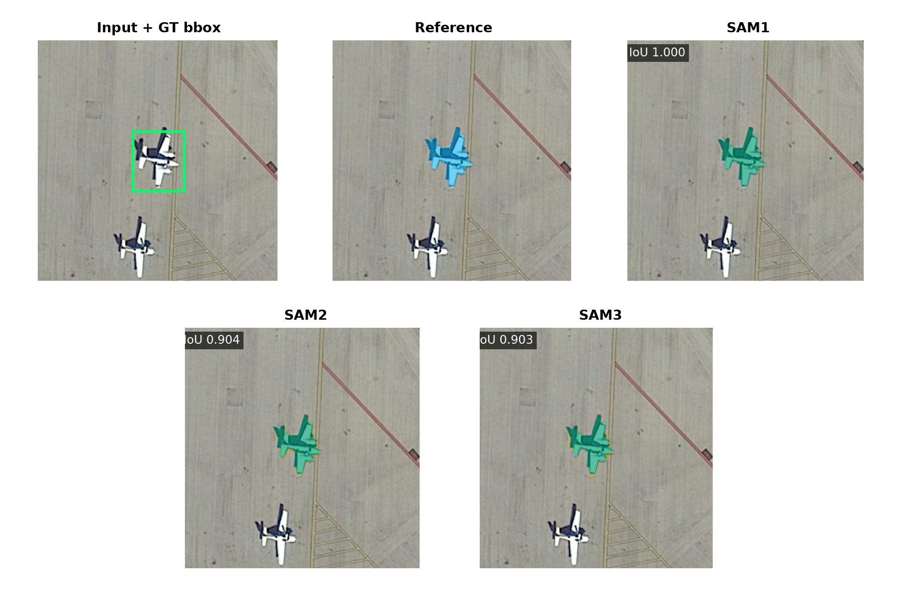
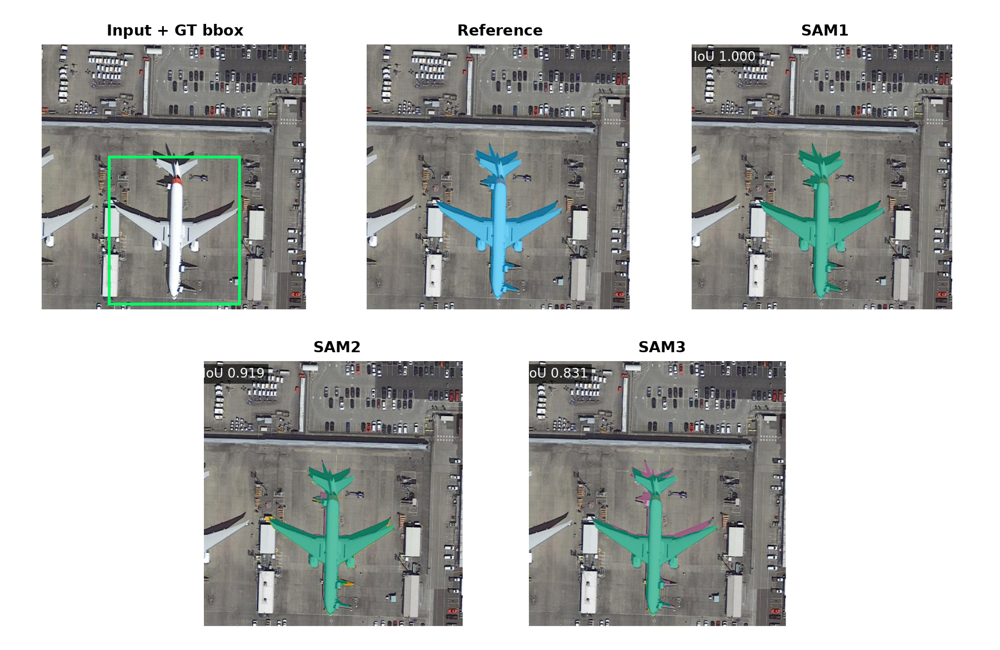
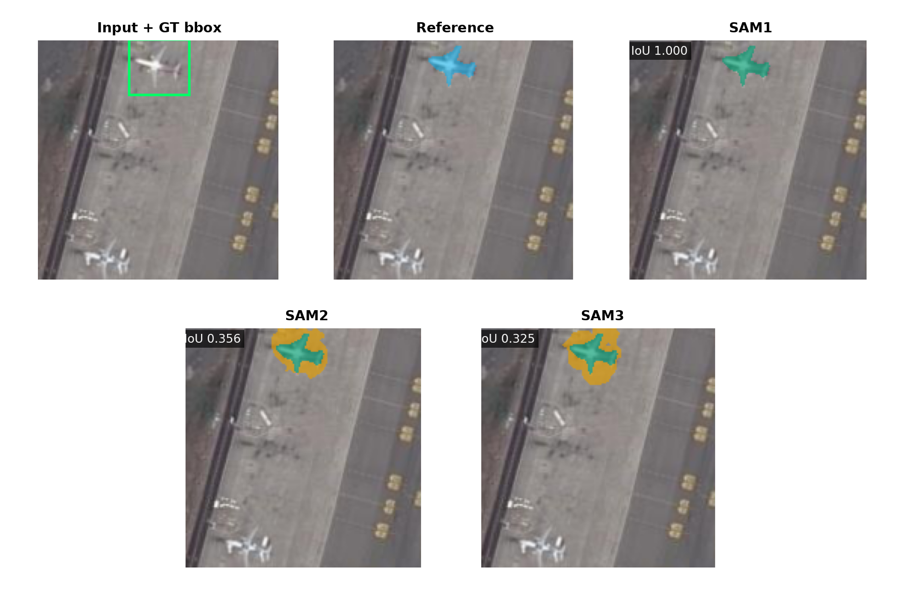
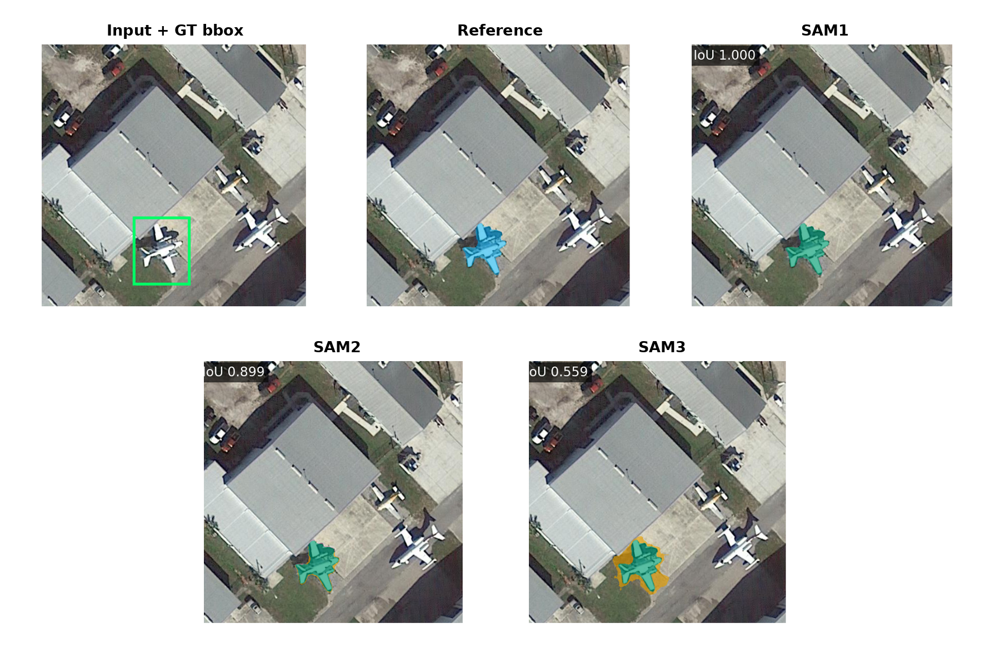

# SAMRS SOTA Plane Segmentation Metric Report

## Scope

- Veri seti SAMRS SOTA-RBB, hedef sınıf plane ve giriş çözünürlüğü 1024×1024'tür.
- Test kümesinde 128 görüntü vardır. Overall tablosu 128 görüntüyü, dört overlap × mask-area tablosunun her biri 32 görüntüyü kapsar.
- SAM1, SAM2 ve SAM3 aynı görüntülerde hem özgün detection bbox hem YOLO bbox ile çalıştırılmıştır.
- YOLO bbox sonuçları üç ayrı YOLO eğitiminin ortalaması ± standart sapmasıdır.
- Resmi SAMRS SOTA maskeleri insan ground truth'u değil, SAM1 ViT-H ile üretilmiş pseudo maskelerdir.

## Metric Logic

- TP, modelin doğru biçimde nesne olarak işaretlediği pikseldir. FP, nesne olmadığı hâlde nesne diye işaretlenen; FN ise nesne olduğu hâlde kaçırılan pikseldir.
- IoU = TP / (TP + FP + FN). Tahmin ve referans maskenin ortak alanını birleşim alanına böler; 1 kusursuz, 0 hiç örtüşme yok demektir.
- Dice = 2TP / (2TP + FP + FN). IoU ile aynı davranışı farklı ölçekle ifade eder.
- Precision = TP / (TP + FP). Modelin boyadığı piksellerin ne kadarının gerçekten nesne olduğunu gösterir; fazla alan boyamak precision değerini düşürür.
- Recall = TP / (TP + FN). Gerçek nesne piksellerinin ne kadarının yakalandığını gösterir; eksik maske recall değerini düşürür.
- Dört ortalama maske metriği nesne örneği düzeyinde (instance-level) önce her uçak için hesaplanır, sonra bütün uçaklar eşit ağırlıkla ortalanır. Büyük uçaklar küçük uçakların sonucunu perdelemez.
- IoU ≥ 0.50/0.75/0.90 sütunları, ilgili IoU eşiğini geçen uçak maskelerinin oranıdır. Bunlar mAP değildir ve raporda mAP gibi adlandırılmaz.
- Maske tablolarında gerçek COCO mask AP gösterilmez. Deney bütün eşleşmemiş detector maskelerini AP biçiminde saklamadığı için eksik tahminlerden uydurma bir mask mAP hesaplanmamıştır.
- Overall tablosu 128 görüntüyü, diğer tabloların her biri 32 görüntüyü kapsar.
- GT-bbox satırları tek sabit koşuldur. YOLO-bbox satırlarındaki değerler üç ayrı YOLO eğitiminin ortalaması ± standart sapmasıdır.

## Dataset Context

- SAMRS SOTA-RBB görüntüleri DOTA v2.0 remote-sensing sahnelerinden gelir.
- Yayımlanan segmentasyon maskeleri, mevcut detection bbox'larının SAM1'e prompt olarak verilmesiyle otomatik üretilmiştir.
- Bu nedenle SAM1 sonucu aynı model ailesinin ürettiği referans biçimine doğal olarak daha yakındır.
- Bağımsız kontrol için eşleşebilen SAMRS test görüntüleri aynı DOTA sahnelerindeki iSAID insan maskelerine de karşılaştırılmıştır.
- Detector mAP değerleri bbox ölçümüdür. Segmentasyon tablolarındaki IoU, Dice, Precision ve Recall ise piksel maskesi ölçümüdür.

## YOLO Detector BBox Metrics

- Bu tablo yalnız YOLO detector kutularını değerlendirir; burada ölçülen bbox başarısıdır, maske başarısı değildir.
- BBox mAP50/mAP75/mAP90, tahmin kutusunun GT kutuyla sırasıyla en az 0,50/0,75/0,90 IoU yaptığı eşiklerde confidence sıralaması boyunca hesaplanan gerçek average precision değeridir.
- BBox mAP50-95, 0,50 ile 0,95 arasındaki on bbox IoU eşiğinin AP ortalamasıdır.
- BBox Precision ve Recall değerleri, doğrulama kümesinde seçilip testten önce sabitlenen güven eşiğinde hesaplanır.
- Tablodaki değerler üç ayrı YOLO eğitiminin ortalaması ± standart sapmasıdır.

| Detector | Images | BBox mAP50 | BBox mAP75 | BBox mAP90 | BBox mAP50-95 | BBox Precision@0.50 | BBox Recall@0.50 | BBox Precision@0.75 | BBox Recall@0.75 | BBox Precision@0.90 | BBox Recall@0.90 |
| --- | --- | --- | --- | --- | --- | --- | --- | --- | --- | --- | --- |
| YOLO26x (3 seed) | 128 | 0.953 ± 0.005 | 0.871 ± 0.009 | 0.279 ± 0.028 | 0.725 ± 0.006 | 0.940 ± 0.017 | 0.896 ± 0.016 | 0.892 ± 0.026 | 0.850 ± 0.012 | 0.443 ± 0.020 | 0.422 ± 0.018 |

## Resmi SAMRS SAM1 Pseudo Referansı

SAMRS SOTA maskeleri SAM1 ViT-H ve özgün detection prompt'larıyla üretilmiş pseudo maskelerdir. Sonuçlar öncelikle bu resmi referansa karşı verilmiştir.

### Overall

| Pipeline | Images | Avg IoU | Avg Dice | Avg Precision | Avg Recall | IoU ≥ 0.50 | IoU ≥ 0.75 | IoU ≥ 0.90 |
| --- | --- | --- | --- | --- | --- | --- | --- | --- |
| SAM1 GT bbox | 128 | 0.997 | 0.998 | 0.999 | 0.998 | 0.999 | 0.997 | 0.996 |
| SAM1 YOLO bbox | 128 | 0.869 ± 0.014 | 0.881 ± 0.015 | 0.878 ± 0.014 | 0.885 ± 0.016 | 0.892 ± 0.015 | 0.877 ± 0.015 | 0.838 ± 0.010 |
| SAM2 GT bbox | 128 | 0.791 | 0.877 | 0.816 | 0.964 | 0.971 | 0.727 | 0.121 |
| SAM2 YOLO bbox | 128 | 0.707 ± 0.010 | 0.785 ± 0.012 | 0.726 ± 0.011 | 0.870 ± 0.015 | 0.860 ± 0.011 | 0.659 ± 0.007 | 0.101 ± 0.002 |
| SAM3 GT bbox | 128 | 0.666 | 0.775 | 0.703 | 0.929 | 0.792 | 0.481 | 0.041 |
| SAM3 YOLO bbox | 128 | 0.591 ± 0.014 | 0.689 ± 0.016 | 0.617 ± 0.015 | 0.845 ± 0.017 | 0.689 ± 0.023 | 0.432 ± 0.012 | 0.036 ± 0.002 |

### No Overlap × Low Mask Area

| Pipeline | Images | Avg IoU | Avg Dice | Avg Precision | Avg Recall | IoU ≥ 0.50 | IoU ≥ 0.75 | IoU ≥ 0.90 |
| --- | --- | --- | --- | --- | --- | --- | --- | --- |
| SAM1 GT bbox | 32 | 0.995 | 0.997 | 1.000 | 0.995 | 1.000 | 0.992 | 0.984 |
| SAM1 YOLO bbox | 32 | 0.751 ± 0.008 | 0.762 ± 0.008 | 0.766 ± 0.009 | 0.760 ± 0.007 | 0.774 ± 0.008 | 0.758 ± 0.008 | 0.734 ± 0.016 |
| SAM2 GT bbox | 32 | 0.781 | 0.872 | 0.813 | 0.959 | 0.976 | 0.694 | 0.113 |
| SAM2 YOLO bbox | 32 | 0.613 ± 0.007 | 0.679 ± 0.007 | 0.636 ± 0.009 | 0.745 ± 0.006 | 0.734 ± 0.014 | 0.599 ± 0.019 | 0.094 ± 0.009 |
| SAM3 GT bbox | 32 | 0.664 | 0.776 | 0.709 | 0.925 | 0.806 | 0.468 | 0.032 |
| SAM3 YOLO bbox | 32 | 0.508 ± 0.011 | 0.593 ± 0.011 | 0.541 ± 0.013 | 0.722 ± 0.008 | 0.605 ± 0.016 | 0.371 ± 0.032 | 0.022 ± 0.005 |

### No Overlap × High Mask Area

| Pipeline | Images | Avg IoU | Avg Dice | Avg Precision | Avg Recall | IoU ≥ 0.50 | IoU ≥ 0.75 | IoU ≥ 0.90 |
| --- | --- | --- | --- | --- | --- | --- | --- | --- |
| SAM1 GT bbox | 32 | 0.979 | 0.984 | 0.986 | 0.983 | 0.991 | 0.972 | 0.963 |
| SAM1 YOLO bbox | 32 | 0.817 ± 0.065 | 0.829 ± 0.068 | 0.826 ± 0.066 | 0.834 ± 0.071 | 0.843 ± 0.072 | 0.824 ± 0.064 | 0.778 ± 0.032 |
| SAM2 GT bbox | 32 | 0.864 | 0.921 | 0.906 | 0.942 | 0.991 | 0.898 | 0.463 |
| SAM2 YOLO bbox | 32 | 0.731 ± 0.061 | 0.783 ± 0.066 | 0.769 ± 0.063 | 0.808 ± 0.070 | 0.833 ± 0.072 | 0.722 ± 0.065 | 0.383 ± 0.019 |
| SAM3 GT bbox | 32 | 0.711 | 0.802 | 0.773 | 0.909 | 0.778 | 0.630 | 0.185 |
| SAM3 YOLO bbox | 32 | 0.565 ± 0.065 | 0.642 ± 0.070 | 0.607 ± 0.067 | 0.773 ± 0.075 | 0.611 ± 0.065 | 0.481 ± 0.070 | 0.170 ± 0.051 |

### Overlap × Low Mask Area

| Pipeline | Images | Avg IoU | Avg Dice | Avg Precision | Avg Recall | IoU ≥ 0.50 | IoU ≥ 0.75 | IoU ≥ 0.90 |
| --- | --- | --- | --- | --- | --- | --- | --- | --- |
| SAM1 GT bbox | 32 | 0.998 | 0.999 | 1.000 | 0.999 | 1.000 | 1.000 | 1.000 |
| SAM1 YOLO bbox | 32 | 0.753 ± 0.034 | 0.774 ± 0.038 | 0.763 ± 0.036 | 0.790 ± 0.042 | 0.793 ± 0.041 | 0.761 ± 0.028 | 0.669 ± 0.008 |
| SAM2 GT bbox | 32 | 0.716 | 0.827 | 0.748 | 0.957 | 0.932 | 0.438 | 0.024 |
| SAM2 YOLO bbox | 32 | 0.553 ± 0.023 | 0.647 ± 0.029 | 0.565 ± 0.024 | 0.784 ± 0.042 | 0.716 ± 0.025 | 0.304 ± 0.009 | 0.013 ± 0.002 |
| SAM3 GT bbox | 32 | 0.633 | 0.759 | 0.686 | 0.907 | 0.821 | 0.258 | 0.005 |
| SAM3 YOLO bbox | 32 | 0.495 ± 0.029 | 0.601 ± 0.034 | 0.519 ± 0.032 | 0.762 ± 0.039 | 0.631 ± 0.046 | 0.181 ± 0.014 | 0.003 ± 0.000 |

### Overlap × High Mask Area

| Pipeline | Images | Avg IoU | Avg Dice | Avg Precision | Avg Recall | IoU ≥ 0.50 | IoU ≥ 0.75 | IoU ≥ 0.90 |
| --- | --- | --- | --- | --- | --- | --- | --- | --- |
| SAM1 GT bbox | 32 | 0.999 | 1.000 | 1.000 | 0.999 | 1.000 | 1.000 | 1.000 |
| SAM1 YOLO bbox | 32 | 0.951 ± 0.006 | 0.958 ± 0.006 | 0.958 ± 0.006 | 0.958 ± 0.006 | 0.965 ± 0.006 | 0.958 ± 0.006 | 0.943 ± 0.008 |
| SAM2 GT bbox | 32 | 0.817 | 0.896 | 0.837 | 0.972 | 0.986 | 0.846 | 0.120 |
| SAM2 YOLO bbox | 32 | 0.792 ± 0.005 | 0.867 ± 0.006 | 0.810 ± 0.005 | 0.940 ± 0.006 | 0.952 ± 0.009 | 0.828 ± 0.003 | 0.105 ± 0.001 |
| SAM3 GT bbox | 32 | 0.676 | 0.778 | 0.701 | 0.943 | 0.778 | 0.569 | 0.039 |
| SAM3 YOLO bbox | 32 | 0.654 ± 0.011 | 0.753 ± 0.012 | 0.677 ± 0.011 | 0.913 ± 0.012 | 0.741 ± 0.016 | 0.555 ± 0.009 | 0.035 ± 0.006 |

## Reference Bias Comparison

Tablo, aynı GT-bbox tahminlerini SAMRS pseudo maskesi ve bağımsız iSAID insan maskesi karşısında ölçer. Yalnız karşılaştırılan referans değişir; güven aralığı aynı kaynak görüntüden gelen örneklerin ilişkisini hesaba katar.

| Model | Human IoU | SAM1 Pseudo IoU | IoU Artışı | %95 Güven Aralığı |
| --- | --- | --- | --- | --- |
| SAM1 | 0.648 | 0.998 | +0.350 | [0.313, 0.378] |
| SAM2 | 0.580 | 0.806 | +0.225 | [0.188, 0.255] |
| SAM3 | 0.540 | 0.723 | +0.184 | [0.142, 0.216] |

## Qualitative Examples

### No Overlap / Low Mask Area

### No Overlap / High Mask Area

### Overlap / Low Mask Area

### Overlap / High Mask Area

## Discussion

- Resmi SAMRS pseudo referansında GT-bbox ortalama IoU değerleri SAM1/SAM2/SAM3 için 0,997/0,791/0,666'dır. SAM1'in neredeyse kusursuz görünmesi veri setinin onun çıktı stiliyle üretilmesinden kaynaklanır.
- YOLO-bbox ortalama IoU değerleri SAM1/SAM2/SAM3 için yaklaşık 0,869/0,707/0,591'dir. Detector hatası eklenince skor düşer; model sırası değişmez.
- Ortak insan denetiminde tahmin sabit tutulup yalnız referans değiştirildiğinde SAM1 IoU 0,648 insan referansından 0,998 pseudo referansa yükselir. IoU artışı +0,350 ve %95 güven aralığı [0,313, 0,378]'dir.
- Aynı enflasyon SAM2 için +0,225, SAM3 için +0,184'tür. Tüm modeller pseudo referansta yükselir; en büyük artış referansı üreten SAM1'dedir.
- Bu bulgu SAMRS'nin pretraining veya weak supervision için değersiz olduğunu göstermez. Ancak aynı teacher ailesinin ürettiği maskeler bağımsız test ground truth'u gibi yorumlanırsa model kalitesi olduğundan yüksek görünür.
- Geçerli downstream değerlendirme bağımsız insan etiketli test setinde yapılmalı; pseudo-mask üreticisi, checkpoint, prompt ve insan-denetimli subset açıkça raporlanmalıdır.
