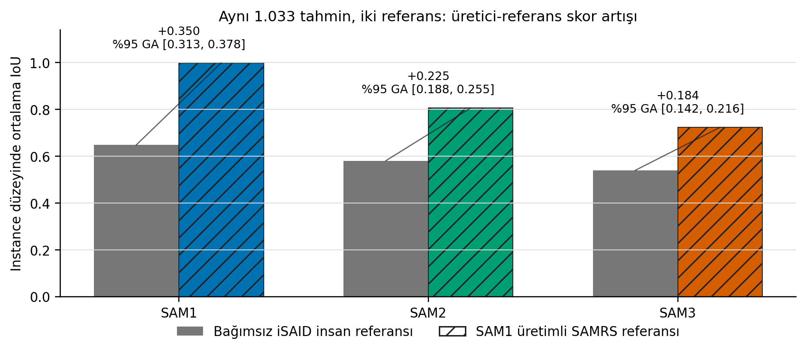
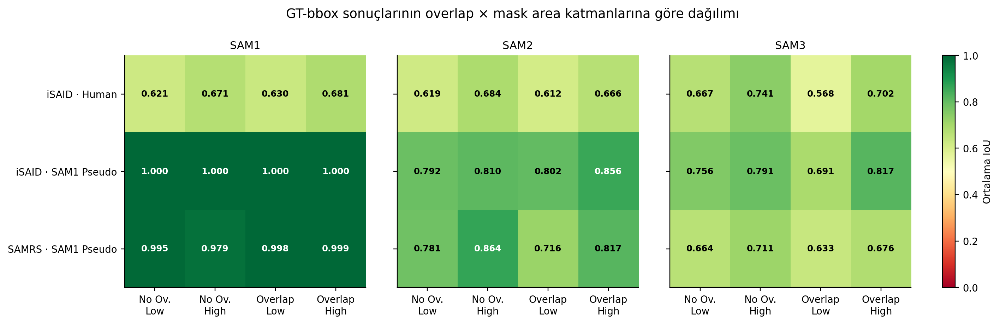

# Öğretmen Kendi Referansına Karşı Ne Kadar İyi? Uzaktan Algılama Segmentasyonunda SAM Üretimli Test Maskelerinin Değerlendirme Yanlılığı

**Durum:** TAMAMLANMIŞ FROZEN SONUÇ
**Çalışma kimliği:** `teacher_reference_bias_v1`
**Tarih:** 2026-07-26

## Öz

Otomatik pseudo-maskeler büyük ölçekli segmentation pretraining için değerlidir;
ancak bu maskeler bağımsız test ground truth'u olarak kullanıldığında referansı
üreten modeli kayırabilir. Bu çalışma, söz konusu **öğretmen-referans
yakınlığı (teacher-reference affinity)** etkisini uzaktan algılama instance segmentation bağlamında
kontrollü olarak ölçmektedir. iSAID ve SAMRS SOTA üzerinde aynı `plane`
sınıfı, aynı 1024x1024 giriş, aynı 128 test görüntüsü, aynı dört
`overlap x mask area` katmanı ve aynı SAM1/SAM2/SAM3 bbox-prompted pipeline'ı
kullanılmıştır. SAMRS SOTA maskelerinin resmi SAM1 ViT-H ve RHBox üretim
provenance'ı exhaustive geometri denetimiyle doğrulanmıştır. Ayrıca 126 SAMRS
tile'ı aynı DOTA görüntülerindeki bağımsız iSAID insan annotation'larına piksel
düzeyinde eşlenmiş; 770 benzersiz uçağın 1.033 crop görünümü için aynı
tahminler iki referansa karşı ölçülmüştür. SAM1'in ortalama IoU'su insan referansında
`0.648`, kendi pseudo referansında
`0.998` olmuş; skor enflasyonu
`0.350` olarak ölçülmüştür. Bulgular SAMRS'nin
weak supervision değerini reddetmez; öğretmen üretimli test maskelerinin
bağımsız benchmark referansı olarak yorumlanmasına sınır koyar.

**Anahtar kelimeler:** remote sensing, Segment Anything, pseudo-label,
evaluation bias, instance segmentation, teacher-reference affinity

## 1. Giriş

Pixel-level uzaktan algılama annotation'ı pahalıdır. SAMRS bu maliyeti azaltmak
için mevcut detection bbox'larını SAM1 prompt'u olarak kullanır ve 1,6
milyondan fazla instance maskesi üretir. Bu yaklaşım pretraining için ölçek
sağlar. Bununla birlikte, aynı öğretmen model kendi ürettiği maskelere karşı
değerlendirildiğinde yüksek skor gerçek nesne sınırlarına uyum ile öğretmenin
karar stilini yeniden üretme etkisini karıştırabilir.

Bu bildirinin katkıları:

1. iSAID ve SAMRS için kaynak-sahne güvenli, eşlenmiş değerlendirme protokolü.
2. Aynı tahminlerin insan ve SAM1 pseudo referansında eşleştirilmiş ölçümü.
3. Kaynak-sahne kümeli 10.000 bootstrap ile referans enflasyonu aralıkları.
4. SAM1, SAM2 ve SAM3 için GT-bbox ile YOLO-bbox sonuçlarının ayrılması.
5. Pseudo-label eğitim yararı ile pseudo-referans benchmark geçerliliğinin
   açık ayrımı.

## 2. İlgili Çalışmalar

SAMRS, DOTA, DIOR, FAIR1M ve HRSC2016 detection annotation'larını SAM ile
maskeye dönüştürür ve ana kullanımını segmentation pretraining olarak
temellendirir. Brachmann ve arkadaşları pseudo-ground-truth üreten referans
algoritmasının benzer re-localisation yöntemlerini kayırabildiğini göstermiştir.
Arazo ve arkadaşlarının confirmation bias çalışması ise hatalı pseudo-label'ın
eğitimde kendini pekiştirebildiğini açıklar. Bizim problemimiz eğitim dinamiği
değil, ölçüm geçerliliği problemidir. SOPSeg'in iSAID ablation'ı küçük
nesnelerde en büyük kazancın decoder'dan önce region-adaptive magnification ve
oriented prompt'tan geldiğini gösterir; bu nedenle veri hazırlama ve prompt
geometrisi model isminden ayrı kontrol edilmelidir.

## 3. Materyal ve Yöntem

### 3.1 Veri ve split

- Hedef sınıf iki veri setinde de `plane`.
- iSAID referansı insan tarafından bağımsız çizilmiş instance polygon'larıdır.
- Tile maskeleri kayıpsız COCO RLE olarak saklanmış; boş maske ve piksel alanı
  uyuşmazlığı exhaustive olarak sıfır doğrulanmıştır.
- iSAID GT prompt'u bu resmi insan annotation'ındaki eksen hizalı bbox'tır.
- SAMRS SOTA referansı SAM1 ViT-H ve original DOTA RHBox prompt'larıyla
  üretilmiş pseudo-maskedir.
- Test seti veri seti başına 128 görüntüdür.
- Dört strata'nın her birinde 32 görüntü bulunur.
- Strata görüntü/tile düzeyindedir: `No Overlap` maksimum plane bbox-pair
  IoU değerinin tam `0`, `Overlap` ise en az `0,001` olmasıdır; aradaki belirsiz
  görüntüler örnekleme havuzuna alınmaz.
- Low/high ayrımı görüntüdeki instance mask alanları toplamının görüntü alanına
  oranının veri seti içi medyanıyla yapılır. Dondurulmuş eşikler iSAID için
  `%1.671` (insan maskesi), SAMRS için
  `%1.193` (SAM1 pseudo maskesi) değeridir. Bu nedenle
  dört strata cross-dataset nedensel kanıt değil, betimleyici zorluk
  kırılımıdır.
- Train, validation ve test arasında source scene kesişimi sıfırdır.
- Hiçbir GT prompt SAM1 pseudo-maskeden yeniden türetilmez. iSAID insan bbox'ı
  ile SAMRS original detection RHBox provenance farkı nedeniyle cross-dataset
  GT-bbox mutlak skorları betimleyicidir.

### 3.2 Dual-reference tasarımı

Kontrollü iSAID deneyinde SAM1 GT-bbox tahmini ikinci pseudo referans
olarak dondurulmuştur. Ortak görüntü denetiminde SAMRS tile'ları iSAID
kaynaklarına geri eşlenmiş ve official SAMRS pseudo-mask ile iSAID insan maskesi
aynı instance üzerinde kullanılmıştır. Prediction sabit kalır; yalnız referans
değişir.

### 3.3 Metrikler ve istatistik

Ana metrik instance-level mask IoU'dur. Dice, pixel precision, pixel recall,
Boundary IoU ve Success@0.50/0.75/0.90 destekleyici metriklerdir. Detector için
COCO bbox AP50, AP75, AP90 ve AP50-95 ayrı raporlanır. Her seed'in YOLO
confidence eşiği validation setinde bbox IoU 0,50 için F1'i en yüksek yapan
noktada dondurulur; test eşik seçimine girmez. Confidence interval hesabında
bağımsız gözlem birimi tile değil source scene'dir. Pairwise model
karşılaştırmalarında source-scene ortalama farkları üzerinde Wilcoxon testi ve
Holm düzeltmesi kullanılır.

YOLO-bbox koşulunda bbox IoU >= 0,50 ile eşleşmeyen GT için boş maske yazılır
ve instance skoru sıfır olur. Eşleşmeyen detector tahminleri detector AP
hesabında false positive, ikincil image-union maskesinde ise tahmin olarak
korunur; bir GT instance satırına yapay biçimde atanmaz. Bu nedenle
instance-level mask tablosu COCO mask AP değildir.

## 4. Sonuçlar

### 4.1 GT-bbox sonuçları

| Veri / referans | Model | IoU | Dice | Precision | Recall | Boundary IoU |
| --- | --- | --- | --- | --- | --- | --- |
| iSAID Plane / İnsan | SAM1 | 0.661 | 0.787 | 0.692 | 0.943 | 0.657 |
| iSAID Plane / İnsan | SAM2 | 0.650 | 0.777 | 0.673 | 0.955 | 0.647 |
| iSAID Plane / İnsan | SAM3 | 0.667 | 0.776 | 0.696 | 0.897 | 0.665 |
| iSAID Plane / SAM1 pseudo | SAM1 | 1.000 | 1.000 | 1.000 | 1.000 | 1.000 |
| iSAID Plane / SAM1 pseudo | SAM2 | 0.831 | 0.900 | 0.889 | 0.929 | 0.828 |
| iSAID Plane / SAM1 pseudo | SAM3 | 0.775 | 0.846 | 0.867 | 0.838 | 0.771 |
| SAMRS SOTA Plane / SAM1 pseudo | SAM1 | 0.997 | 0.998 | 0.999 | 0.998 | 0.997 |
| SAMRS SOTA Plane / SAM1 pseudo | SAM2 | 0.791 | 0.877 | 0.816 | 0.964 | 0.790 |
| SAMRS SOTA Plane / SAM1 pseudo | SAM3 | 0.666 | 0.775 | 0.703 | 0.929 | 0.665 |

### 4.2 Aynı 1.033 tile-instance tahmini, iki referans

SAMRS pseudo-mask ile iSAID insan maskesi arasındaki ortalama IoU
`0.647`'tür. Bu değer pseudo referansın
yüksek kaliteli fakat insan ground truth ile özdeş olmadığını gösterir.
Bu `1.033` satır, SAMRS'nin örtüşen tile'ları nedeniyle `770` benzersiz
insan-anotasyonlu uçağın farklı crop görünümleridir; belirsizlik hesabı `35`
kaynak sahne düzeyinde kümelenmiştir. Her benzersiz uçağın görünümleri önce
kendi içinde ortalandığında IoU enflasyonu SAM1, SAM2 ve SAM3 için sırasıyla
`0.349`,
`0.227` ve
`0.181` olarak
aynı yönde kalmıştır.

| Model | İnsan IoU | SAM1 pseudo IoU | Enflasyon | %95 GA |
| --- | --- | --- | --- | --- |
| SAM1 | 0.648 | 0.998 | 0.350 | [0.313, 0.378] |
| SAM2 | 0.580 | 0.806 | 0.225 | [0.188, 0.255] |
| SAM3 | 0.540 | 0.723 | 0.184 | [0.142, 0.216] |

İnsan ve pseudo referansta model sırası bu örneklemde değişmemiştir
(`Spearman = 1.0`,
`Kendall tau = 1.0`).
Dolayısıyla ana bulgu ranking reversal değil, model ailesine göre farklılaşan
güçlü skor enflasyonudur.

### 4.3 YOLO detector

| Veri | Seed | Eşik | P@IoU50 | R@IoU50 | AP50 | AP75 | AP90 | AP50-95 |
| --- | --- | --- | --- | --- | --- | --- | --- | --- |
| iSAID Plane | 3 | 0.305 | 0.939 | 0.903 | 0.936 | 0.862 | 0.622 | 0.795 |
| SAMRS SOTA Plane | 3 | 0.700 | 0.940 | 0.896 | 0.953 | 0.871 | 0.279 | 0.725 |

### 4.4 YOLO-bbox segmentation

| Veri / referans | Model | Seed | IoU | IoU std | Dice |
| --- | --- | --- | --- | --- | --- |
| iSAID Plane / İnsan | SAM1 | 3 | 0.607 | 0.003 | 0.721 |
| iSAID Plane / İnsan | SAM2 | 3 | 0.596 | 0.002 | 0.711 |
| iSAID Plane / İnsan | SAM3 | 3 | 0.626 | 0.003 | 0.728 |
| iSAID Plane / SAM1 pseudo | SAM1 | 3 | 0.881 | 0.007 | 0.890 |
| iSAID Plane / SAM1 pseudo | SAM2 | 3 | 0.760 | 0.004 | 0.820 |
| iSAID Plane / SAM1 pseudo | SAM3 | 3 | 0.726 | 0.006 | 0.792 |
| SAMRS SOTA Plane / SAM1 pseudo | SAM1 | 3 | 0.869 | 0.014 | 0.881 |
| SAMRS SOTA Plane / SAM1 pseudo | SAM2 | 3 | 0.707 | 0.010 | 0.785 |
| SAMRS SOTA Plane / SAM1 pseudo | SAM3 | 3 | 0.591 | 0.014 | 0.689 |

## 5. Tartışma

SAM1'in official SAMRS referansında yaklaşık kusursuz görünmesi, bağımsız insan
sınırlarına göre kusursuz olduğu anlamına gelmez. Aynı 1.033 tahminde
referansın değiştirilmesi SAM1 için yaklaşık 0,35 IoU farkı üretmiştir. SAM2 ve
SAM3 de pseudo referansta yükselmiş, ancak artış öğretmen SAM1 için en büyük
olmuştur. Bu desen genel veri seti zorluğuyla açıklanamaz; görüntü, instance,
bbox ve tahmin sabittir.

Sonuç SAMRS'nin değersiz olduğunu göstermez. Pseudo-maskeler pretraining,
distillation ve weak supervision için yararlı olabilir. Geçerli downstream
fayda bağımsız insan etiketli test setinde ölçülmelidir. Pseudo-mask benchmark
olarak kullanılacaksa üretici model, checkpoint, prompt türü ve insan denetimi
subset açıkça raporlanmalıdır.

SOPSeg bağlamı, remote sensing small-object segmentation'da sonraki ilerlemenin
yalnız yeni SAM sürümünden gelmeyebileceğini gösterir. Scale-aware crop,
magnification, oriented bbox bilgisini kullanan prompt ve boundary-aware
refinement güçlü adaylardır. Ancak bu teknikler öğretmen-referans yanlılığını
çözmez; yine bağımsız referans gerekir.

### 5.1 Sınırlılıklar

- Ortak insan denetimi 128 görüntünün 126'sını ve 1.375 tile-instance'ın
  1.033'ünü kapsar. Örtüşen crop'lar nedeniyle bunlar 770 benzersiz insan
  anotasyonlu uçağa karşılık gelir.
- iSAID testi resmi insan etiketli validation havuzundan, SAMRS testi ise
  source-scene grouped ayrımdan gelir; bu nedenle veri setleri arası mutlak
  skor farkı yalnız referans kaynağına bağlanamaz.
- iSAID ve SAMRS annotation protokolleri insan/pseudo kaynağın yanında kendi
  tanım farklarına da sahip olabilir.
- GT prompt provenance'ı da farklıdır: iSAID resmi insan polygon envelope'u,
  SAMRS özgün DOTA detection RHBox'ıdır.
- YOLO hyperparameter'ları ve epok sayısı aynıdır; ancak eğitim görüntüsü
  sayıları farklı olduğu için 100 epok iki veri setinde aynı optimizer adımı
  sayısına karşılık gelmez. Epok-temelli warm-up'taki ilk üç kaydedilmiş
  öğrenme oranı da batch sayısına bağlı olarak çok küçük farklılaşır;
  dördüncü epoktan sonra çizelge aynıdır. Bu nedenle cross-dataset detector
  farkı yalnız veri zorluğuna bağlanamaz.
- Ana çalışma tek `plane` sınıfına odaklanır.
- Üç modelin sıralaması ortak audit subset'inde değişmemiştir.
- Sonuçlar pseudo-label ile eğitimin faydasını doğrudan ölçmez.

## 6. Sonuç

Teacher-generated maskeler eğitim verisi ve benchmark referansı olarak aynı
statüde değerlendirilmemelidir. Aynı görüntü ve tahmin üzerinde yalnız
referansın değiştirilmesi SAM1 skorunu yaklaşık 0,35 IoU yükseltmiştir.
Uzaktan algılama segmentation benchmark'ları üretici provenance'ı, bağımsız
insan denetimi ve eşleştirilmiş referans duyarlılığı raporlamalıdır.

## Kaynaklar

1. Wang et al. SAMRS: Scaling-up Remote Sensing Segmentation Dataset with
   Segment Anything Model. NeurIPS Datasets and Benchmarks, 2023.
2. Kirillov et al. Segment Anything. ICCV, 2023.
3. Zamir et al. iSAID: A Large-scale Dataset for Instance Segmentation in Aerial
   Images. CVPR Workshops, 2019.
4. Brachmann et al. On the Limits of Pseudo Ground Truth in Visual Camera
   Re-localisation. ICCV, 2021.
5. Arazo et al. Pseudo-Labeling and Confirmation Bias in Deep Semi-Supervised
   Learning. IJCNN, 2020.
6. Warfield et al. Validation of Image Segmentation by Estimating Rater Bias
   and Variance. Philosophical Transactions A, 2008.
7. SOPSeg: Prompt-based Small Object Instance Segmentation in Remote Sensing.
   arXiv:2509.03002, 2025.
