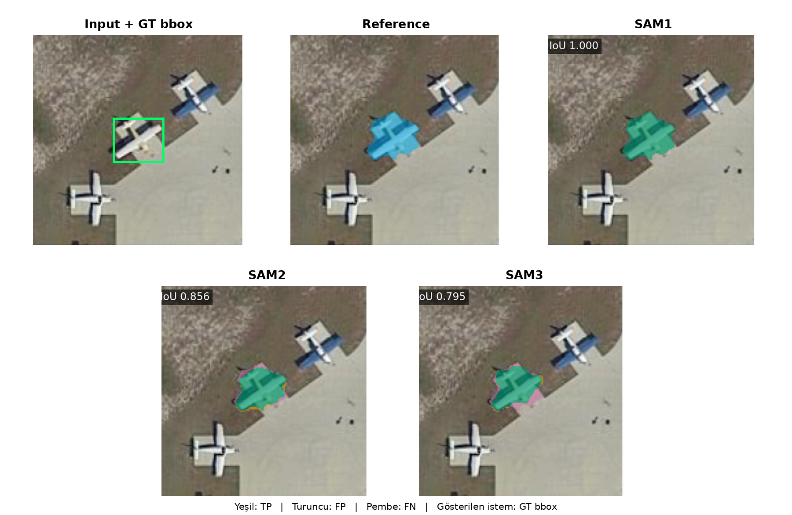
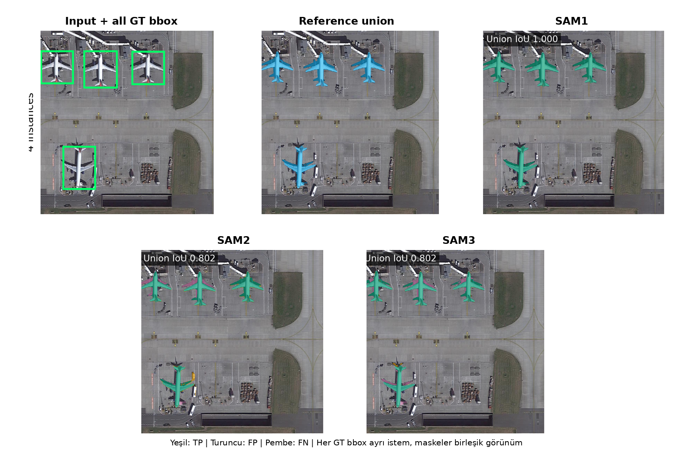
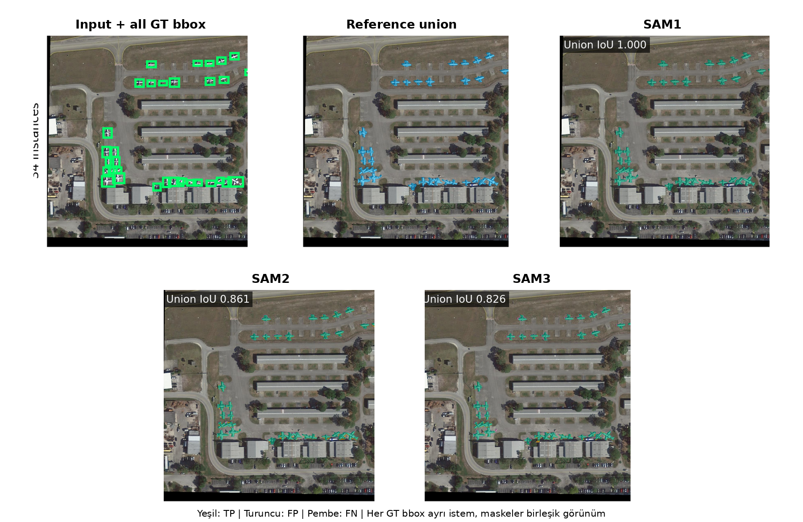
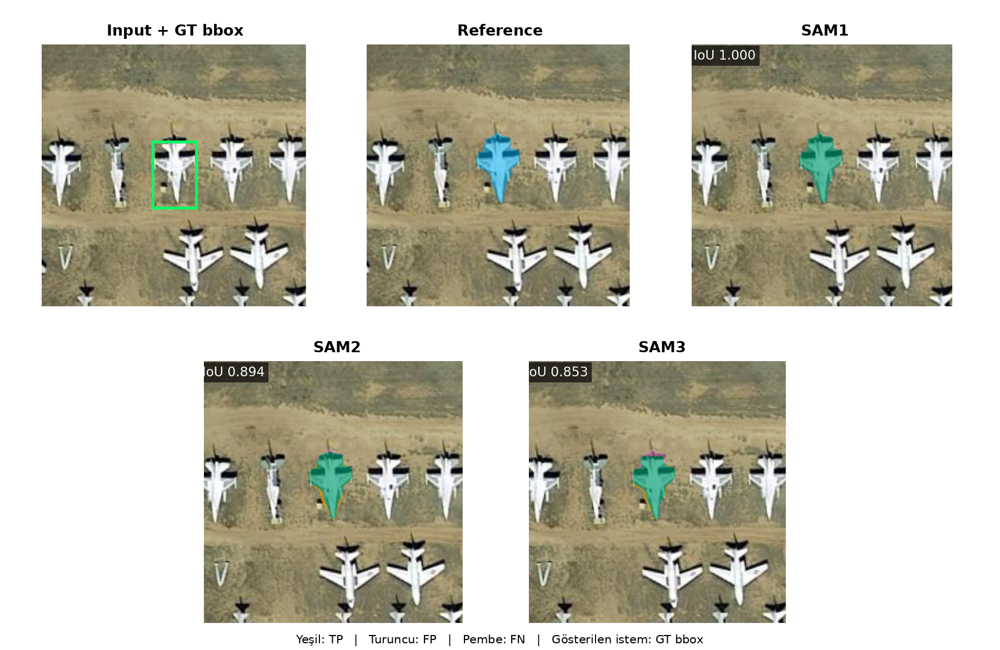

# iSAID Plane SAM1 Pseudo Reference Full Metric Document

## Scope

- Veri seti iSAID, hedef sınıf plane ve model giriş çözünürlüğü 1024×1024 pikseldir.
- Test kümesi 512 görüntüdür. Dört overlap × mask-area grubunun her birinde tam 128 görüntü vardır.
- Strata tanımı gereği 512 test görüntüsünün tamamında en az bir uçak vardır; detector tablosu negatif arka plan görüntülerini içeren resmi tam benchmark değil, bu dengeli pozitif test alt kümesindeki gerçek COCO bbox değerlendirmesidir.
- No Overlap, görüntüdeki hiçbir iki GT bbox'un kesişmemesi; Overlap ise en az bir bbox çiftinin IoU değerinin 0,001 veya üstünde olmasıdır.
- Low/High Mask Area ayrımı, görüntüdeki toplam resmi iSAID insan uçak maskesi alanının veri seti için testten önce dondurulan eşiğin altında veya üstünde olmasına göre yapılır.
- SAM1, SAM2 ve SAM3 aynı görüntülerde hem GT bbox hem YOLO bbox istemiyle çalıştırılmıştır.
- YOLO detector her veri setinde ayrıca eğitilmiştir; SAM1, SAM2 ve SAM3 bu veri setlerinde yeniden eğitilmeden veya ince ayar yapılmadan yalnız bbox istemiyle kullanılmıştır.
- Detector protokolü aynı olsa da iSAID eğitim bölümü 1.571, SAMRS eğitim bölümü 2.191 görüntüdür; bu nedenle veri setleri arasındaki detector skoru farkı yalnız referans kaynağına bağlanan kontrollü bir etki değildir.
- YOLO bbox sonuçları deney başlamadan önce sabitlenen seed 42 ile eğitilmiş tek YOLO26x detector sonucudur.
- Maske metrikleri uçak örneği düzeyinde hesaplanır; büyük nesneler küçük nesnelerin sonucunu piksel sayısıyla baskılamaz.

## Metric Logic

- TP, modelin doğru biçimde nesne olarak işaretlediği pikseldir. FP, nesne olmadığı hâlde nesne diye işaretlenen; FN ise nesne olduğu hâlde kaçırılan pikseldir.
- IoU = TP / (TP + FP + FN). Tahmin ve referans maskenin ortak alanını birleşim alanına böler; 1 kusursuz, 0 hiç örtüşme yok demektir.
- Dice = 2TP / (2TP + FP + FN). IoU ile aynı davranışı farklı ölçekle ifade eder.
- Precision = TP / (TP + FP). Modelin boyadığı piksellerin ne kadarının gerçekten nesne olduğunu gösterir; fazla alan boyamak precision değerini düşürür.
- Recall = TP / (TP + FN). Gerçek nesne piksellerinin ne kadarının yakalandığını gösterir; eksik maske recall değerini düşürür.
- Dört ortalama maske metriği nesne örneği düzeyinde (instance-level) önce her uçak için hesaplanır, sonra bütün örnekler eşit ağırlıkla ortalanır. Büyük nesneler küçük nesnelerin sonucunu perdelemez.
- IoU ≥ 0.50/0.75/0.90 sütunları, ilgili IoU eşiğini geçen uçak maskelerinin oranıdır. Bunlar mAP değildir ve raporda mAP gibi adlandırılmaz.
- YOLO'nun kaçırdığı bir gerçek uçak, YOLO-bbox maske tablosunda boş tahmin olarak değerlendirilir ve o örneğin maske skorları sıfır olur. Herhangi bir gerçek nesneyle eşleşmeyen yanlış pozitif YOLO kutuları ise instance maske ortalamasına sahte bir referans örneği olarak eklenmez; bunların etkisi detector Precision, Recall ve mAP değerlerinde ölçülür.
- Maske tabloları her GT uçak örneğini değerlendirir; YOLO'nun eşleştiremediği GT örnekleri de boş tahmin ve sıfır skorla hesaba katılır. Bu değerlendirme gerçek COCO segmentation AP ile aynı değildir. Confidence sırasındaki bütün maskeleri ve yanlış pozitifleri kullanan uçtan uca COCO mask AP bu raporda ayrıca çalıştırılmadığı için IoU eşik oranları AP veya mAP diye yeniden adlandırılmamıştır.
- Overall tablosu 512 görüntüyü, diğer tabloların her biri 128 görüntüyü kapsar.
- GT-bbox satırları tek sabit koşuldur. YOLO-bbox satırlarındaki değerler sabit seed 42 sonucudur.

## Dataset Context

- Bu belge bağımsız benchmark sonucu değildir; referans kaynağı yanlılığını ölçen kontrollü deneydir.
- iSAID veri seti kaynağı: https://captain-whu.github.io/iSAID/
- iSAID: A Large-scale Dataset for Instance Segmentation in Aerial Images makalesi: https://arxiv.org/abs/1905.12886
- Görüntüler, bbox istemleri ve model tahminleri insan referansı deneyindekiyle aynıdır. Yalnız değerlendirme referansı SAM1 pseudo maskesidir.
- Bu rapordaki GT bbox, resmi iSAID insan instance anotasyonunda verilen kutudur; pseudo maskeden türetilmemiştir.
- Referansı üreten SAM1'in kendi pseudo maskelerine yüksek benzerlik göstermesi teacher-reference bias beklentisidir.
- Beş tam bağımsız iSAID insan referans tablosu ayrı full metric belgede verilmiştir. Bu belgede yalnız aynı tahminlerin referans değişimine duyarlılığını gösteren kısa karşılaştırma özeti bulunur.

## YOLO Detector BBox Metrics

- Bu tablo yalnız YOLO detector kutularını değerlendirir; burada ölçülen bbox başarısıdır, maske başarısı değildir.
- BBox mAP50/mAP75/mAP90, tahmin kutusunun GT kutuyla sırasıyla en az 0,50/0,75/0,90 IoU yaptığı eşiklerde confidence sıralaması boyunca hesaplanan gerçek average precision değeridir.
- BBox mAP50-95, 0,50 ile 0,95 arasındaki on bbox IoU eşiğinin AP ortalamasıdır.
- BBox Precision ve Recall değerleri, doğrulama kümesinde seçilip testten önce sabitlenen güven eşiğinde hesaplanır.
- Tablodaki değerler sabit seed 42 sonucudur.

| Detector | Images | BBox mAP50 | BBox mAP75 | BBox mAP90 | BBox mAP50-95 | BBox Precision@0.50 | BBox Recall@0.50 | BBox Precision@0.75 | BBox Recall@0.75 | BBox Precision@0.90 | BBox Recall@0.90 |
| --- | --- | --- | --- | --- | --- | --- | --- | --- | --- | --- | --- |
| YOLO26x (seed 42) | 512 | 0.920 | 0.847 | 0.545 | 0.762 | 0.925 | 0.896 | 0.868 | 0.840 | 0.632 | 0.612 |

## Kontrollü SAM1 Pseudo Referansı

Aynı iSAID görüntülerindeki GT bbox'lar SAM1'e verilmiş ve dondurulan çıktılar pseudo referans olarak kullanılmıştır.

### Overall

Referans: Kontrollü SAM1 Pseudo Referansı. Bu tablo 512 görüntüdeki 5.447 uçak örneğini kapsar. YOLO bbox değerleri sabit seed 42 sonucudur.

| Pipeline | Images | Avg IoU | Avg Dice | Avg Precision | Avg Recall | IoU ≥ 0.50 | IoU ≥ 0.75 | IoU ≥ 0.90 |
| --- | --- | --- | --- | --- | --- | --- | --- | --- |
| SAM1 GT bbox | 512 | 1.000 | 1.000 | 1.000 | 1.000 | 1.000 | 1.000 | 1.000 |
| SAM1 YOLO bbox | 512 | 0.873 | 0.883 | 0.886 | 0.882 | 0.891 | 0.879 | 0.843 |
| SAM2 GT bbox | 512 | 0.827 | 0.898 | 0.874 | 0.939 | 0.966 | 0.845 | 0.263 |
| SAM2 YOLO bbox | 512 | 0.750 | 0.812 | 0.793 | 0.844 | 0.874 | 0.778 | 0.249 |
| SAM3 GT bbox | 512 | 0.795 | 0.871 | 0.875 | 0.880 | 0.955 | 0.793 | 0.151 |
| SAM3 YOLO bbox | 512 | 0.721 | 0.787 | 0.795 | 0.789 | 0.864 | 0.733 | 0.145 |

### No Overlap × Low Mask Area

Referans: Kontrollü SAM1 Pseudo Referansı. Bu tablo 128 görüntüdeki 439 uçak örneğini kapsar. YOLO bbox değerleri sabit seed 42 sonucudur.

| Pipeline | Images | Avg IoU | Avg Dice | Avg Precision | Avg Recall | IoU ≥ 0.50 | IoU ≥ 0.75 | IoU ≥ 0.90 |
| --- | --- | --- | --- | --- | --- | --- | --- | --- |
| SAM1 GT bbox | 128 | 1.000 | 1.000 | 1.000 | 1.000 | 1.000 | 1.000 | 1.000 |
| SAM1 YOLO bbox | 128 | 0.852 | 0.861 | 0.861 | 0.865 | 0.861 | 0.859 | 0.838 |
| SAM2 GT bbox | 128 | 0.795 | 0.875 | 0.850 | 0.925 | 0.929 | 0.779 | 0.173 |
| SAM2 YOLO bbox | 128 | 0.720 | 0.785 | 0.761 | 0.824 | 0.847 | 0.745 | 0.162 |
| SAM3 GT bbox | 128 | 0.751 | 0.838 | 0.860 | 0.840 | 0.925 | 0.674 | 0.082 |
| SAM3 YOLO bbox | 128 | 0.684 | 0.760 | 0.787 | 0.749 | 0.838 | 0.645 | 0.068 |

### No Overlap × High Mask Area

Referans: Kontrollü SAM1 Pseudo Referansı. Bu tablo 128 görüntüdeki 622 uçak örneğini kapsar. YOLO bbox değerleri sabit seed 42 sonucudur.

| Pipeline | Images | Avg IoU | Avg Dice | Avg Precision | Avg Recall | IoU ≥ 0.50 | IoU ≥ 0.75 | IoU ≥ 0.90 |
| --- | --- | --- | --- | --- | --- | --- | --- | --- |
| SAM1 GT bbox | 128 | 1.000 | 1.000 | 1.000 | 1.000 | 1.000 | 1.000 | 1.000 |
| SAM1 YOLO bbox | 128 | 0.881 | 0.893 | 0.903 | 0.889 | 0.902 | 0.876 | 0.828 |
| SAM2 GT bbox | 128 | 0.820 | 0.889 | 0.896 | 0.900 | 0.957 | 0.826 | 0.310 |
| SAM2 YOLO bbox | 128 | 0.758 | 0.822 | 0.835 | 0.825 | 0.886 | 0.743 | 0.291 |
| SAM3 GT bbox | 128 | 0.771 | 0.857 | 0.912 | 0.827 | 0.953 | 0.664 | 0.156 |
| SAM3 YOLO bbox | 128 | 0.699 | 0.776 | 0.837 | 0.739 | 0.859 | 0.608 | 0.143 |

### Overlap × Low Mask Area

Referans: Kontrollü SAM1 Pseudo Referansı. Bu tablo 128 görüntüdeki 1.708 uçak örneğini kapsar. YOLO bbox değerleri sabit seed 42 sonucudur.

| Pipeline | Images | Avg IoU | Avg Dice | Avg Precision | Avg Recall | IoU ≥ 0.50 | IoU ≥ 0.75 | IoU ≥ 0.90 |
| --- | --- | --- | --- | --- | --- | --- | --- | --- |
| SAM1 GT bbox | 128 | 1.000 | 1.000 | 1.000 | 1.000 | 1.000 | 1.000 | 1.000 |
| SAM1 YOLO bbox | 128 | 0.868 | 0.879 | 0.883 | 0.876 | 0.890 | 0.878 | 0.841 |
| SAM2 GT bbox | 128 | 0.808 | 0.889 | 0.853 | 0.943 | 0.976 | 0.796 | 0.118 |
| SAM2 YOLO bbox | 128 | 0.733 | 0.801 | 0.773 | 0.841 | 0.879 | 0.747 | 0.108 |
| SAM3 GT bbox | 128 | 0.770 | 0.855 | 0.845 | 0.878 | 0.948 | 0.746 | 0.032 |
| SAM3 YOLO bbox | 128 | 0.695 | 0.767 | 0.768 | 0.776 | 0.855 | 0.695 | 0.026 |

### Overlap × High Mask Area

Referans: Kontrollü SAM1 Pseudo Referansı. Bu tablo 128 görüntüdeki 2.678 uçak örneğini kapsar. YOLO bbox değerleri sabit seed 42 sonucudur.

| Pipeline | Images | Avg IoU | Avg Dice | Avg Precision | Avg Recall | IoU ≥ 0.50 | IoU ≥ 0.75 | IoU ≥ 0.90 |
| --- | --- | --- | --- | --- | --- | --- | --- | --- |
| SAM1 GT bbox | 128 | 1.000 | 1.000 | 1.000 | 1.000 | 1.000 | 1.000 | 1.000 |
| SAM1 YOLO bbox | 128 | 0.878 | 0.886 | 0.887 | 0.887 | 0.894 | 0.884 | 0.849 |
| SAM2 GT bbox | 128 | 0.846 | 0.909 | 0.887 | 0.948 | 0.967 | 0.892 | 0.360 |
| SAM2 YOLO bbox | 128 | 0.765 | 0.821 | 0.801 | 0.854 | 0.872 | 0.812 | 0.344 |
| SAM3 GT bbox | 128 | 0.823 | 0.889 | 0.887 | 0.901 | 0.966 | 0.872 | 0.238 |
| SAM3 YOLO bbox | 128 | 0.748 | 0.807 | 0.805 | 0.816 | 0.875 | 0.802 | 0.233 |

## Reference Bias Comparison

Görüntü, uçak örneği, bbox ve model tahmini aynıdır; yalnız karşılaştırılan referans maske insan etiketinden SAM1 pseudo etiketine değişir. Bu nedenle fark, referans kaynağına duyarlılığı doğrudan gösterir.

| Model | BBox | Human IoU | SAM1 Pseudo IoU | IoU Artışı |
| --- | --- | --- | --- | --- |
| SAM1 | GT bbox | 0.653 | 1.000 | +0.347 |
| SAM1 | YOLO bbox | 0.597 | 0.873 | +0.276 |
| SAM2 | GT bbox | 0.629 | 0.827 | +0.198 |
| SAM2 | YOLO bbox | 0.574 | 0.750 | +0.177 |
| SAM3 | GT bbox | 0.655 | 0.795 | +0.140 |
| SAM3 | YOLO bbox | 0.595 | 0.721 | +0.126 |

## Qualitative Examples

Her sayfa bir gruptan tek görüntüyü gösterir. Görüntüdeki bütün GT uçak kutuları modele ayrı istemler olarak verilmiş ve instance maskeleri yalnız bu görsel için birleştirilmiştir. Tablolar instance-level kalır. Yeşil TP, turuncu FP ve pembe FN piksellerini gösterir.

### No Overlap / Low Mask Area

### No Overlap / High Mask Area

### Overlap / Low Mask Area

### Overlap / High Mask Area

## Discussion

- SAM1 pseudo referansında GT-bbox Overall IoU değerleri SAM1/SAM2/SAM3 sırasıyla 1,000/0,827/0,795 olarak ölçülmüştür.
- Kontrollü pseudo referans doğrudan SAM1 GT-bbox tahmininden dondurulduğu için SAM1 GT-bbox satırı bir kimlik kontrolüdür; bu satır bağımsız segmentasyon başarısı olarak yorumlanmaz.
- SAM1 pseudo referansında YOLO-bbox Overall IoU değerleri SAM1/SAM2/SAM3 sırasıyla 0,873/0,750/0,721 olarak ölçülmüştür.
- Aynı GT-bbox tahminleri insan yerine SAM1 pseudo referansla ölçüldüğünde IoU değişimi SAM1/SAM2/SAM3 için sırasıyla 0,347/0,198/0,140 olmuştur.
- GT-bbox model sıralamasının lideri insan referansında SAM3 (0.655), SAM1 pseudo referansında SAM1 (1.000) olmuştur.
- Tam GT-bbox sıralaması insan referansında SAM3 > SAM1 > SAM2, SAM1 pseudo referansında SAM1 > SAM2 > SAM3 biçimindedir; görülen değişim pseudo referansın model seçimini etkileyebileceği riskini gösterir.
- Bu sıralamalar tablo nokta tahminleridir; birbirine yakın insan-referanslı skorlar tek başına istatistiksel üstünlük iddiası değildir.
- GT bbox yerine YOLO bbox kullanıldığında pseudo-referanslı Overall IoU kaybı SAM1/SAM2/SAM3 için sırasıyla 0,127/0,077/0,074 olmuştur.
- GT-bbox üç-model ortalamasında en yüksek alt grup Overlap × High Mask Area (0.890), en düşük alt grup No Overlap × Low Mask Area (0.849) olmuştur.
- SAM1 gt bbox koşulunda Overall Precision 1.000, Recall 1.000 olmuştur. Precision ve Recall dengelidir.
- SAM1'in kendisinin ürettiği referansa yakınlığı, gerçek insan çizimli sınır doğruluğuyla aynı şey değildir.
- Pseudo etiketler eğitim veya ön-etiketleme için kullanılabilir; ancak bağımsız test ground truth'u yerine kullanıldığında sonuç model ailesine yanlı görünebilir.
